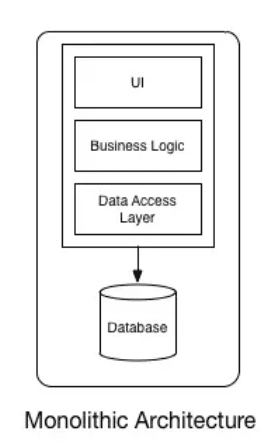
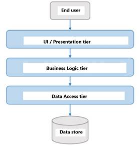
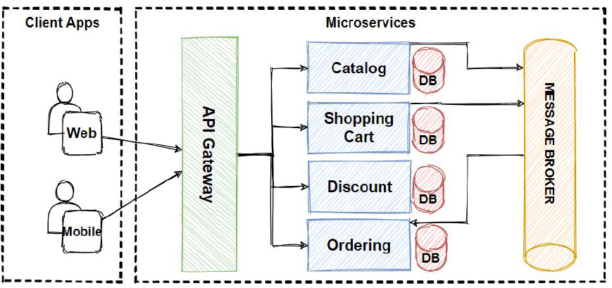

# Introduction

## Objectifs

- Il existe un certain nombre de notions à connaître pour comprendre ce cours

- IoC, IoD, API REST, Spring, etc.

- Ce cours a pour but de vous présenter ou rappeler ces notions

---

## IoC

- **I**nversion **o**f **C**ontrol

- En français : inversion de contrôle

- Principe de programmation

----

## IoC

### Définition

- Consiste à déléguer la gestion du cycle de vie des objets à un conteneur logiciel.

- Le conteneur est responsable de la création et de la destruction des objets.

- La gestion des composants (plugins) est déléguée à un framework ou un runtime

> .NET, Spring, etc.

----

## IoC avec Spring

- L'interface `ApplicationContext` est le conteneur IoC de Spring

- C'est lui qui gère le cycle de vie des objets

- Autrement dit, on lui délègue la gestion des plugins nécessaires à notre application

> L'IoC est là pour nous simplifier la vie !

----

## IoC

### Encapsulation

- Ici, nous "encapsulons" la gestion des plugins dans un conteneur

- C'est lui qui va s'occuper de la création et de la destruction des objets

> Nous n'avons pas à nous soucier de la complexité de la gestion des plugins

----

## IoC avec Spring

### En images


---

## DI

### Définition

- **D**ependency **I**njection

- En français : injection de dépendances

- Mécanisme très important en programmation orientée objet

----

## DI

### Définition

- Une dépendance désigne une relation de nécessité entre deux composants d'un système.

- Un objet A a besoin d'un objet B pour fonctionner.

- En UML, on les représente via des relations d'**agrégation**.

----

## DI

### Dans le code

- On parle de DI lorsque l'on passe une dépendance à un objet via son constructeur ou ses setters.

```java [5-7]
public class ClasseAvecDependance {

    private final Dependance dependance;

    public ClasseAvecDependance(Dependance dependance) {
        this.dependance = dependance;
    }

}
```

> Couplage faible entre les objets

----

## DI

### Avec Spring

- Spring permet d'injecter des dépendances via l'IoC

- On utilisera des **annotations** pour indiquer à Spring comment injecter les dépendances

- L'IoC de Spring va alors s'occuper de créer les objets et de les injecter !

---

## Architectures

### Trois grands types

On distingue 3 grandes familles d'architectures logicielles :

- Monolithique

- N-tiers

- Microservices

----

## Monolithique

### Définition

- Toutes les fonctionnalités sont regroupées dans une seule application

- Le front et le back sont dans le même projet !

- Le déploiement est généralement simple, mais la maintenance peut être compliquée

----

## Monolithique

### En image

 <!-- .element width="30%" -->

----

## Monolithique

### Exemple

- Symfony (PHP)

- Java EE

- WordPress

- etc.

----

## Monolithique

### Avantages

- Déploiement plus simple

- Une seule codebase pour le front et le back : un seul framework à maîtriser

- Premières itérations rapides

----

## Monolithique

### Inconvénients

- Évolutivité plus complexe au fil du temps

- Ne peut être déployé que sur un seul serveur

- Single point of failure !

----

## N-tiers

### Définition

- Une des architectures les plus répandues

- Les fonctionnalités sont réparties dans plusieurs applications

- On distingue généralement 3 couches : front, back et base de données

- On parle de "couches" ou de "tiers"

----

## N-tiers

### Les tiers

- "N" tiers et non 3 tiers, car il peut y avoir plus de 3 couches

- On peut ajouter des couches de cache, de sécurité, de queuing, etc.

- Voire un backoffice qui sera un front à part entière

----

## N-tiers

### En image



----

## N-tiers

### Avantages

- Évolutivité plus simple

- Découplage des responsabilités

- Possibilité de déployer les couches sur des serveurs différents

----

## N-tiers

### Inconvénients

- Déploiement plus complexe

- Plusieurs codebases à maintenir

- Plusieurs frameworks à maîtriser

- La logique métier est dans un seul projet (le back)

----

## Microservices

### Définition

- Les fonctionnalités sont réparties dans **plusieurs applications**

- Souvent, on entend plusieurs backends, mais il peut y avoir plusieurs frontends

- Chaque service est **indépendant** et peut être déployé séparément

- Chaque service a sa propre base de données, son propre framework, etc.

----

## Microservices

### Philosophie

- L'objectif est de créer des services indépendants et autonomes

- Si un service tombe, les autres continuent de fonctionner

- On peut aussi choisir la **technologie la plus adaptée à chaque service** !

- Que ce soit pour la BDD ou le framework

----

## Microservices

### Découpage

- L'objectif est de créer des services différents en fonction de leur **responsabilité**

- L'une des erreurs de conceptions les plus communes est de vouloir faire des services les plus petits possibles

- En réalité, on cherche à faire des services **aussi petits que nécessaire** !

----

## Microservices

### Communication

- Plutôt que d'avoir plusieurs controllers : on va avoir plusieurs projets

- Les projets vont communiquer entre eux via des requêtes HTTP

----

## Microservices

### Communication

- Généralement, un service a une fonction d'**agrégateur**, pour aggloremérer les données des autres services

- Pour éviter d'avoir des adresses différentes, un **reverse proxy** est utilisé (API Gateway)

----

## Microservices

### En image




---

## API

### Définition

- **A**pplication **P**rogramming **I**nterface

- En français : interface de programmation

- Service qui sera appelé par d'autres applications (front, back, etc.) sans intervention humaine

- On parle d'API REST lorsque l'API respecte les contraintes de l'architecture REST

----

## REST

### Définition

- **RE**presentational **S**tate **T**ransfer

- En français : transfert d'état représentationnel

- Ensemble de contraintes architecturales pour créer des API

- Elle est dite Restful si elle respecte un ensemble de contraintes

----

## REST

### Contraintes

- Client-serveur via des requêtes HTTP

- Stateless : pas de session, chaque requête est indépendante

- Mise en cache possible pour rationaliser les requêtes

- Interface uniforme : les ressources sont identifiées par des URI uniques

----

## REST

### Contraintes

- Auto-descriptif : Comprend des méta-données pour décrire les ressources (Content-Type, etc.)

- Les ressources sont manipulées via des représentations (JSON)

- Couches invisibles pour hiérarchiser les systèmes (sécurité, cache, etc.)

- Code à la demande (facultatif) : possibilité d'envoyer du code exécutable

----

## REST

### Dans l'ensemble

- L'objectif est de créer des API simples, évolutives et performantes

- Les API REST sont très répandues et utilisées par de nombreuses entreprises

- Ce n'est pas la seule architecture possible (GraphQL, SOAP, etc.)

----

## REST

### Dans l'ensemble

- On a une **seule URI** pour une ressource donnée

- On ne doit faire qu'**une seule requête** pour récupérer **toutes les données** nécessaires

- On ne doit pas avoir à faire plusieurs requêtes pour récupérer les données

- Les données renvoyées peuvent différer de la manière donc elles sont stockées en BDD

----

## REST

### Exemple

GET : `/api/users`

```json
[
  {
    "id": 1,
    "name": "John Doe",
    "email": "jd@gmail.com"
  },
  {
    "id": 2,
    "name": "Jane Doe",
    "email": "jad@gmail.com"
  }
]
```

----

## REST

### Exemple

GET : `/api/users/1`

```json
{
  "id": 1,
  "name": "John Doe",
  "email": "jd@gmail.com"
}
```

----

## REST

### Exemple

POST : `/api/users`

```json
{
  "name": "Michel Tabanero",
  "email": "mt@gmail.com"
}
```

