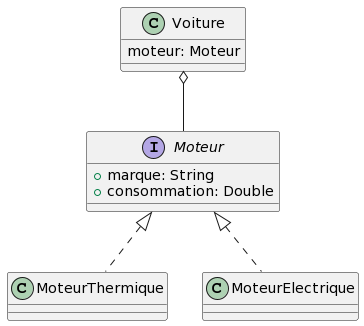

# Spring

## Introduction

 <!-- .element: width="20%" align="left"-->

 <!-- .element: width="40%" align="right"-->

----

## Spring

### Qu'est-ce que c'est ?

- Parler de "Spring" peut signifier plusieurs choses :

  - Spring Framework : la base de Spring

  - Spring Boot : un ensemble d'outils/projets pour Spring

> Dans un premier temps, nous parlerons de Spring Framework

----

## Spring

### Présentation

- Framework Java

- Créé en 2003 par Rod Johnson (v0.9)

- Basé sur l'IoC

----

## Spring

### Objectifs

- Simplifier le développement d'applications Java et palier à J2EE.

- Spring ne reprend pas les concepts de J2EE, mais les réinvente.

- Il intègre des spécifications choisies parmi J2EE.

----

## Spring

### Hérités de J2EE

- Servlets API
- WebSockets API
- Concurrency Utilities
- JSON Binding API
- JPA, JMS, JTA, etc.

----

## Spring

### Les projets Spring

De nombreux projets ont été créés autour de Spring :

- Spring Boot, Spring Core

- Spring Cloud, Spring Data

- Spring Security

- Et bien d'autres !

> Une véritable galaxie !

----

## Spring

### Spring Core

- Le coeur de Spring (core container)

- Contient également Sprint MVC, qui permet de créer des applications web et de gérer le Data Access

----

## Spring

### Spring Data

- Permet de simplifier l'accès aux données

- Permet la création de repositories, en utilisant des interfaces !

> C'est presque de la magie noire !

----

## Spring

### Spring Security

- Permet de sécuriser les applications Spring

- Gère la partie Authentification et Authorisation

----

## Spring

### Spring Cloud

- Permet de créer des applications distribuées

- Aide à répondre aux contraintes des architectures microservices

----

## Spring

### Spring Boot : un projet pour les gouverner tous

- Permet la mise en place rapide d'une application Spring

- Automatise la configuration de Spring

- Propose des 'starters' de dépendances

- Permet d'inclure les dépendances Spring, et d'autres !

----

## Spring Core

### `ApplicationContext`

- Conteneur IoC de Spring, implémentation de l'interface `BeanFactory`

- Fournit des services tels que l'injection de dépendances, la gestion du cycle de vie des objets, etc.

- Il initialise les beans et les assemble.

- Il configure les plugins nécessaires à l'application, et les configure

----

## Spring Core

### Annotations

- `ApplicationContext` utilise des annotations pour configurer les plugins

- `@Component`, `@Service`, `@Repository`, `@Controller`, `@RestController`, etc.

- Le programme va scanner les classes annotées pour les ajouter au contexte

> Comparable aux décorateurs avec NestJS, Angular, etc.

----

## Spring Core

### En étapes

- Scanner les classes annotées

- Créer les instances des classes annotées

- Injecter les dépendances **après** avoir créé les instances

> Il se base sur les getters/setters pour injecter les dépendances

----

## Spring Core

### getters/setters

- Les getters/setters sont d'une importance capitale pour Spring !

- C'est en passant par les getters/setters que Spring va injecter les dépendances

- Les classes doivent donc posséder des getters/setters pour chaque dépendance

- Elles doivent aussi posséder un constructeur **avec et sans paramètres** !

----

## Spring Core

### Configuration

- La configuration est faite via des fichiers XML ou des annotations

- Sur des gros projets, elle peut s'avérer complexe

- C'est pourquoi Spring Boot a été créé !

---

# Spring

## Spring Boot

 <!-- .element: width="40%" align="right"-->

 <!-- .element: width="20%" align="left"-->

----

## Spring Boot

### Présentation

- Spring Boot est un ensemble d'outils pour Spring

- Il permet de créer des applications Spring rapidement

- La configuration est nettement simplifiée !

----

## Spring Boot

### Spring Initializr

- Spring Initializr est un outil qui permet la génération d'un projet Spring Boot

- Il suffit de cocher les dépendances nécessaires, et tout se fait automatiquement !

- On peut passer par le [site](https://start.spring.io/) ou directement via IntelliJ !

----

## Spring Boot

### Spring Initializr

En ligne : 

- Rendez-vous sur [https://start.spring.io/](https://start.spring.io/)

- Remplissez les métadonnées du projet

- Sélectionnez les dépendances nécessaires

- Un ZIP contenant le projet est téléchargé !

----

## Spring Boot

### Spring Initializr

Sur IntelliJ (ultimate) :

- File > New > Project

- Sélectionnez Spring Initializr

- Remplissez les métadonnées du projet et sélectionnez les dépendances nécessaires

- Un projet est créé !

----

## Spring Boot

### Installation des plugins

- Tous les plugins nécessaires sont déjà installés dans le projet

- Il n'y a quasiment rien à faire : c'est déjà prêt !

----

## Spring Boot

### Créez un projet !

Créez un projet Maven avec les dépendances suivantes :

- Lombock

> Laissez vous guider par votre IDE. En cas de problème, pensez à vider le cache !

---

## Spring Beans

### Démonstration !

Gestion des Beans avec Spring



----

## Spring

### Le schéma

- Ici, nous avons une classe `Voiture` qui possède un `Moteur`

- Ce moteur peut être `Thermique` ou `Electrique`

- On va se concentrer sur le moteur thermique pour le moment

----

## Spring

### `Moteur.java`

```java
public interface Moteur {

    public String getMarque();
    public Double getConsommation();

    public void setMarque(String marque);
    public void setConsommation(Double consommation);
}
```

----

## Spring

### `MoteurThermique.java`

```java
public class MoteurThermique implements Moteur {
  private String marque;
  private Double consommation;

  public MoteurThermique(String marque, Double consommation) {
    this.marque = marque;
    this.consomation = consommation;
  }

  public MoteurThermique() {
  }

  public String getMarque() {
    return marque;
  }


  public Double getConsommation() {
    return consomation;
  }

  public void setMarque(String marque) {
    this.marque = marque;
  }

  public void setConsommation(Double consomation) {
    this.consomation = consomation;
  }

  public String toString() {
    return "MoteurThermique de marque " + marque + " consommant " + consomation + "L/100km";
  }
}
```

----

## Spring

### `Voiture.java`

```java
public class Voiture {

    Moteur moteur;

    public Voiture(Moteur moteur) {
        this.moteur = moteur;
    }
    
    public Voiture() {
    }

    public Moteur getMoteur() {
        return moteur;
    }

    public void setMoteur(Moteur moteur) {
        this.moteur = moteur;
    }

    @Override
    public String toString() {
        return "Voiture avec un moteur " + moteur + "!";
    }
}
```

----

## Spring

### `Main.java`

Actuellement, si nous voulons créer une instance de `Voiture`, nous devons créer une instance de `Moteur` et l'injecter dans la voiture.

```java
public class Main {
    public static void main(String[] args) {
        Moteur moteur = new MoteurThermique("Renault", 5.0);
        Voiture voiture = new Voiture(moteur);
        System.out.println(voiture);
    }
}
```

----

## Spring

### Injection

- L'injection de dépendances est un concept clé de Spring

- Avec quelques annotations, nous pouvons demander à Spring de s'occuper de l'injection !

----

## Spring

### `@Component`

- `@Component` est une annotation qui permet de déclarer une classe comme un composant Spring

- Spring va alors scanner les classes annotées et les ajouter au contexte

- On peut les ajouter sur chaque classe concrète

----

## Spring

### `MoteurThermique.java`

```java [1-2]
@Component
public class MoteurThermique implements Moteur {
    private String marque;
    private Double consomation;

    public MoteurThermique(String marque, Double consomation) {
        this.marque = marque;
        this.consomation = consomation;
    }

    public MoteurThermique() {
    }

    public String getMarque() {
        return marque;
    }


    public Double getConsommation() {
        return consomation;
    }
    
    public void setMarque(String marque) {
        this.marque = marque;
    }

    public void setConsommation(Double consomation) {
        this.consomation = consomation;
    }

    @Override
    public String toString() {
        return "MoteurThermique de marque " + marque + " consommant " + consomation + "L/100km";
    }
}
```

----

## Spring

### `Voiture.java`

```java [1-2]
@Component
public class Voiture {

    Moteur moteur;

    public Voiture(Moteur moteur) {
        this.moteur = moteur;
    }
    
    public Voiture() {
    }

    public Moteur getMoteur() {
        return moteur;
    }

    public void setMoteur(Moteur moteur) {
        this.moteur = moteur;
    }

    @Override
    public String toString() {
        return "Voiture avec un moteur " + moteur + "!";
    }
}
```

----

## Spring

### `Main.java`

```java [1-3 | 6-7 | 8-10]
// Annotation qui permet de créer le contexte
// Scan le package et ses sous-packages, pour détecter les classes annotées
@ComponentScan(basePackageClasses = Main.class)
public class Main {
    public static void main(String[] args) {
        // Permet de créer le contexte et d'injecter les dépendances
        ApplicationContext context = new AnnotationConfigApplicationContext(Main.class);
        // Permet de récupérer un bean du contexte
        // On lui passe en paramètre la classe du bean
        Voiture voiture = context.getBean(Voiture.class);
        System.out.println(voiture);
    }
}
```

Output : `Voiture avec un moteur MoteurThermique de marque null consommant nullL/100km!`

----

## Spring

### La magie !

- Spring a créé une instance de `MoteurThermique` et l'a injectée dans la voiture !

- Nous n'avons rien eu à faire, si ce n'est ajouter les annotations !

- C'est la magie de Spring !

----

## Spring

### Les étapes

- Pour créer l'instance de `Voiture`, Spring a dû créer l'instance de `MoteurThermique`

- Il a d'abord appelé le constructeur sans paramètres de `MoteurThermique`

- Puis il a appelé le setter `setMarque` pour injecter la marque (ici à `null`), idem pour la consommation

----

## Spring

### Les étapes

- Ensuite, création de l'instance de `Voiture`, en appelant le constructeur sans paramètres

- Enfin, appel du setter `setMoteur` pour injecter le moteur

- Facile ici, car nous n'avons qu'un seul type de moteur. 

- Mais que se passe-t-il si nous avons plusieurs types de moteurs ?

----

## Spring

### `MoteurElectrique.java`

```java
@Component
public class MoteurElectrique implements Moteur {
    private String marque;
    private Double consommation;
    
    public MoteurElectrique(String marque, Double consommation) {
        this.marque = marque;
        this.consomation = consommation;
    }
    
    public MoteurElectrique() {
    }

    public String getMarque() {
        return marque;
    }

    public Double getConsommation() {
        return consommation;
    }

    public void setMarque(String marque) {
        this.marque = marque;
    }

    public void setConsommation(Double consommation) {
        this.consommation = consommation;
    }
}
```

----

## Spring

### `Main.java`

`NonUniqueBeanDefinitionException: No qualifying bean of type 'Moteur' available: expected single matching bean but found 2: moteurThermique,motheurElectrique`

- Si nous exécutons à nouveau le programme, nous obtenons une erreur !

- Il nous dit qu'il a trouvé deux beans de type `Moteur` : `moteurThermique` et `motheurElectrique`

- Il n'a pas pu choisir lequel injecter dans la voiture !

----

## Spring

### `@Primary`

- Pour résoudre ce problème, nous pouvons utiliser l'annotation `@Primary`

- Elle permet de définir un bean comme étant le bean par défaut

- Il sera préféré aux autres beans du même type en cas de conflit !

----

## Spring

### `MoteurThermique.java`

```java [1]
@Component
@Primary
public class MoteurThermique implements Moteur {
    private String marque;
    private Double consomation;

    public MoteurThermique(String marque, Double consomation) {
        this.marque = marque;
        this.consomation = consomation;
    }

    public MoteurThermique() {
    }

    public String getMarque() {
        return marque;
    }


    public Double getConsommation() {
        return consomation;
    }

    public void setMarque(String marque) {
        this.marque = marque;
    }

    public void setConsommation(Double consomation) {
        this.consomation = consomation;
    }

    @Override
    public String toString() {
        return "MoteurThermique de marque " + marque + " consommant " + consomation + "L/100km";
    }
}
```

----

## Spring

### `Main.java`

`Voiture avec un moteur MoteurThermique de marque null consommant nullL/100km!`

- Cette fois, nous retrouvons bien notre voiture avec un moteur thermique !

- Toutefois, les valeurs sont à `null`.

- Une autre annotation permet de résoudre ce problème : `@Value`

----

## Spring

### `@Value`

Peut être placée sur les setters pour définir une valeur par défaut

```java [24, 29]
@Component
@Primary
public class MoteurThermique implements Moteur {
    private String marque;
    private Double consomation;

    public MoteurThermique(String marque, Double consomation) {
        this.marque = marque;
        this.consomation = consomation;
    }

    public MoteurThermique() {
    }

    public String getMarque() {
        return marque;
    }


    public Double getConsommation() {
        return consomation;
    }

    @Value("Default")
    public void setMarque(String marque) {
        this.marque = marque;
    }

    @Value("50.0")
    public void setConsommation(Double consomation) {
        this.consomation = consomation;
    }

    @Override
    public String toString() {
        return "MoteurThermique de marque " + marque + " consommant " + consomation + "L/100km";
    }
}
```

----

## Spring

### `Main.java`

`Voiture avec un moteur MoteurThermique de marque Default consommant 50.0L/100km!`

- Nous avons bien notre voiture avec un moteur thermique, et les valeurs par défaut !

- Nous avons vu comment injecter des dépendances avec Spring

---

# Spring

## Lombok

 <!-- .element: width="20%" align="left"-->

 <!-- .element: width="40%" align="right"-->

----

## Lombok

### Présentation

- Lombok est une bibliothèque Java qui permet de générer du code

- Elle ne fait pas partie de Spring, mais est très utilisée avec

- Elle permet de réduire le code boilerplate, en utilisant des annotations

- Elle est très utilisée avec Spring Boot, pour générer des getters et setters, des constructeurs, etc.

----

## Lombok

### Installation

- Nous l'avons ajouté au projet via **Spring Initializr**

- Il peut aussi être ajouté à postériori, dans le fichier `pom.xml`

----

## Lombok

### `@Getter`

- Annotation qui permet de générer les getters

- Il est placé au-dessus d'un champ (attribut)

- A utiliser si vos getters sont vides !

> NB : On ne peut pas avoir l'annotation ET le getter rédigé à la main !

----

## Lombok

### `@Getter`

```java [3-6]
@Component
public class MoteurElectrique implements Moteur {
    @Getter
    private String marque;
    @Getter
    private Double consommation;
    
    public MoteurElectrique(String marque, Double consommation) {
        this.marque = marque;
        this.consomation = consommation;
    }
    
    public MoteurElectrique() {
    }


    public void setMarque(String marque) {
        this.marque = marque;
    }

    public void setConsommation(Double consommation) {
        this.consommation = consommation;
    }
}
```

----

## Lombok

### `@Setter`

- Annotation qui permet de générer les setters

- Peut également être placé au-dessus d'un champ (attribut)

- A utiliser si vos setters sont vides !

----

## Lombok

### `@Setter`

```java [3-8]
@Component
public class MoteurElectrique implements Moteur {
    @Getter
    @Setter
    private String marque;
    @Getter
    @Setter
    private Double consommation;
    
    public MoteurElectrique(String marque, Double consommation) {
        this.marque = marque;
        this.consomation = consommation;
    }
    
    public MoteurElectrique() {
    }
}
```

----

## Lombok

### `@NoArgsConstructor`

- Annotation qui permet de générer un constructeur sans paramètres

- Doit être placé au-dessus de la classe

----

## Lombok

### `@NoArgsConstructor`

```java [1-2]
@Component
@NoArgsConstructor
public class MoteurElectrique implements Moteur {
    @Getter
    @Setter
    private String marque;
    @Getter
    @Setter
    private Double consommation;
    
    public MoteurElectrique(String marque, Double consommation) {
        this.marque = marque;
        this.consomation = consommation;
    }
}
```

----

## Lombok

### `@AllArgsConstructor`

- Annotation qui permet de générer un constructeur avec tous les paramètres

- Doit être placé au-dessus de la classe

----

## Lombok

### `@AllArgsConstructor`

```java [1-2]
@Component
@AllArgsConstructor
@NoArgsConstructor
public class MoteurElectrique implements Moteur {
    @Getter
    @Setter
    private String marque;
    @Getter
    @Setter
    private Double consommation;
}
```

----

## Spring

### `@Value`

- Bien entendu, on peut aussi utiliser `@Value` avec Lombok !

- On le place au-dessus des champs (attributs)

----

## Spring

### `@Value`

```java [0]
@Component
public class MoteurElectrique implements Moteur {
    @Getter
    @Setter
    @Value("Default Electrique")
    private String marque;

    @Getter
    @Setter
    @Value("10.0")
    private Double consommation;

    @Override
    public String toString() {
        return "MoteurElectrique de marque " + marque + " consommant " + consommation + "L/100km";
    }

}
```

----

## Lombok

### Autres annotations

Il existe d'autres annotations, comme :

- `@ToString` : Génère la méthode `toString`
- `@EqualsAndHashCode` : Génère les méthodes `equals` et `hashCode`
- `@Data` : Génère les méthodes `toString`, `equals`, `hashCode`, les getters et setters

> Voir la [documentation](https://projectlombok.org/features/all) pour plus d'informations

----

## Lombok

### Le mot de la fin

- Nous avons vu comment diminuer la rédaction de code répétitif avec Lombok

- Notez que, si vous devez ajouter de la logique dans vos getters/setters, il faudra les rédiger à la main !

- Lombok est là pour amoindrir les tâches répétitives, pas pour remplacer le code !