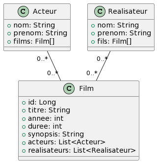

# Spring Boot

## Création d'API REST

 <!-- .element: width="20%" align="left"-->

 <!-- .element: width="40%" align="right"-->

----

## Spring Boot

### Initialiser le projet

Pour créer une API rest, il faudra les dépendances suivantes :

- Spring Web

- Spring Data JPA

- Spring Boot DevTools (optionnel)

- Lombok (optionnel)

----

## Spring Boot

### Spring Web

- Permet de créer des API REST

- Basé sur Spring MVC

- Utilise Apache Tomcat par défaut en tant que conteneur

----

## Spring Boot

### Spring Web

- C'est grâce à Spring Web que l'on peut créer des API REST

- Elle permettra de build l'application et de l'exporter en tant que JAR

- On pourra ainsi exécuter des requêtes HTTP sur l'application

> Et le mieux : Tout est déjà configuré !

----

## Spring Boot

### Spring Data JPA

- Permet de créer la couche d'accès aux données

- Basé sur Spring Data et Hibernate

- Basé sur SQL, mais dispose de son équivalent MongoDB : Spring Data MongoDB

> Intègre le connecteur, et l'ORM tout configuré !

----

## Spring Boot

### Spring Boot DevTools

- Intègre le LiveReload

- Accélère le redémarrage de l'application en mode dev

> Un incontournable en développement !

----

## Spring Boot

### Créez un projet

- File > New > Project
- Sélectionnez Spring Initializr
- Choisissez un nom de projet
- Ajoutez :
    - Spring Web
    - Spring Boot DevTools
    - Lombok
- Cliquez sur Next

----

## Spring Boot

### Tour du propriétaire

```shell
└───src
    ├───main
    │   ├───java
    │   │   └───fr
    │   │       └───octocorn
    │   │           └───democoursapi
    │   │                   # Point d'entrée de l'app (Main)
    │   │                   DemoCoursApiApplication.java
    │   │
    │   └───resources
    │       │   # Fichier de configuration de l'app
    │       │   application.properties
    │       │ 
    │       ├───static
    │       └───templates
```

----

## Spring Boot

### `DemoCoursApiApplication.java`

- Point d'entrée de l'application

- Comparable à une classe `Main`

- Annoté avec `@SpringBootApplication`

----

## Spring Boot

### `@SpringBootApplication`

Annotation qui regroupe plusieurs annotations :

- `@EnableAutoConfiguration` : Active la configuration automatique de Spring Boot

- `@ComponentScan` : Active le scan des composants

- `@Configuration` : Indique que la classe est une configuration Spring

> Sans cette classe, nos beans ne seront pas créés, et l'application ne pourra pas démarrer !

----

## Spring Boot

### `application.properties`

- Fichier de configuration de l'application

- Peut être remplacé par un fichier `application.yml`

- On pourra lui ajouter des propriétés de configuration :
    - Port d'écoute
    - Base de données
    - Variables d'environnement
    - etc.

---

# Spring Boot

## Mon premier contrôleur

 <!-- .element: width="20%" align="left"-->

 <!-- .element: width="40%" align="right"-->

----

## Controller

### Démonstration

----

## Controller

### Créer un contrôleur

- Clic droit sur le package `fr.octocorn.democoursapi`

- New > Class

- Nommez la classe `helloworld.HelloController`

----

## Controller

### HelloController

Pour être identifié comme contrôleur, il faut ajouter l'annotation `@RestController` sur la classe.

```java [0]

@RestController
public class HelloController {
}
```

----

## Controller

### HelloController

Une annotation pour chaque type de requête :

- `@GetMapping` : GET
- `@PostMapping` : POST
- `@PutMapping` : PUT
- `@DeleteMapping` : DELETE
- `@PatchMapping` : PATCH

----

## Controller

### Annotations sur les méthodes

- Les annotations peuvent prendre un paramètre

- Il s'agira de l'URI de la requête

----

## Controller

### `@GetMapping`

```java [5]

@RestController
public class HelloController {

    @GetMapping("/hello") // GET http://localhost:8080/hello
    public String hello() {
        return "GET sur Hello World";
    }
}
```

> Buildez et testez avec Postman !

----

## Controller

### `@PostMapping`

```java [5]

@RestController
public class HelloController {

    @PostMapping("/hello") // POST http://localhost:8080/hello
    public String helloPost() {
        return "POST sur Hello World";
    }
}
```

> Buildez et testez avec Postman !

----

## Controller

### `@PutMapping`

```java [5]

@RestController
public class HelloController {

    @PutMapping("/hello") // PUT http://localhost:8080/hello
    public String helloPut() {
        return "PUT sur Hello World";
    }
}
```

> Buildez et testez avec Postman !

----

## Controller

### `@DeleteMapping`

```java [5]

@RestController
public class HelloController {

    @DeleteMapping("/hello") // DELETE http://localhost:8080/hello
    public String helloDelete() {
        return "DELETE sur Hello World";
    }
}
```

> Buildez et testez avec Postman !

----

## Controller

### `@PatchMapping`

```java [5]

@RestController
public class HelloController {

    @PatchMapping("/hello") // PATCH http://localhost:8080/hello
    public String helloPatch() {
        return "PATCH sur Hello World";
    }
}
```

> Buildez et testez avec Postman !

----

## Controller

### `@RequestMapping`

- Permet de définir une URI pour plusieurs types de requêtes

- Prend en paramètre une chaîne de caractères ou un tableau de chaînes de caractères

- Peut être ajoutée sur la classe ou sur les méthodes

----

## Controller

### `@RequestMapping` sur la classe

```java [3]

@RestController
@RequestMapping("/hello")
public class HelloController {

    @GetMapping // GET http://localhost:8080/hello
    public String hello() {
        return "GET sur Hello World";
    }

    @PostMapping // POST http://localhost:8080/hello
    public String helloPost() {
        return "POST sur Hello World";
    }
}
```

> Buildez et testez avec Postman !

----

## Controller

### `@RequestMapping` sur la méthode

```java [6]

@RestController
@RequestMapping("/hello")
public class HelloController {

    @RequestMapping(method = RequestMethod.POST) // POST http://localhost:8080/hello
    public String helloPost() {
        return "POST sur Hello World";
    }
}
```

> Buildez et testez avec Postman !

----

## Controller

### `@RequestMapping` sur la méthode

```java [5]

@RestController
public class HelloController {

    @RequestMapping(value = "/hello", method = RequestMethod.POST) // POST http://localhost:8080/hello
    public String helloPost() {
        return "POST sur Hello World";
    }
}
```

> Buildez et testez avec Postman !

----

## Controller

### Récupérer des valeurs

- Dans une vraie application, les requêtes POST, PUT et PATCH contiendront des données

- Il existe deux moyen de les transmettre :
    - Via l'URI (chemin)
    - En paramètre de la requête (?name=Peter)
    - Via le corps de la requête (body)

- Des annotations permettent de récupérer ces valeurs

----

## Controller

### `{variable}` dans l'URI

- On peut définir des variables dans l'URI

- On le précisera en paramètre de l'annotation

- On pourra ensuite récupérer la valeur de la variable en paramètre de la méthode

----

## Controller

### `@PathVariable`

- Permet de récupérer une variable dans l'URI

- Cette annotation s'ajoute dans les paramètres de la méthode

- Elle est placée juste avant le type/nom de la variable

----

## Controller

### `@PathVariable`

```java [0 | 5-6]

@RestController
public class HelloController {

    @PostMapping("/hello/{name}") // POST http://localhost:8080/hello/Peter
    public String helloPost(@PathVariable String name) {
        return "Hello " + name + " !";
    }
}
```

----

## Controller

### `@RequestParam`

- Permet de récupérer une variable dans le corps de la requête

- Comme pour `@PathVariable`, elle s'ajoute dans les paramètres de la méthode

- Elle peut prendre en paramètre :
    - Une valeur par défaut
    - Si la variable est obligatoire ou non
    - Etc.

----

## Controller

### `@RequestParam`

```java [6]

@RestController
public class HelloController {

    @PostMapping("/hello") // POST http://localhost:8080/hello?name=Alex
    public String helloPost(@RequestParam String name) {
        return "Hello " + name + " !";
    }
}
```

----

## Controller

### `@RequestParam`

Avec paramètre facultatif :

```java [6]

@RestController
public class HelloController {

    @PostMapping("/hello") // POST http://localhost:8080/hello
    public String helloPost(@RequestParam(required = false) String name) {
        return "Hello " + name + " !";
    }
}
```

----

## Controller

### `@RequestParam`

Avec valeur par défaut :

```java [6]

@RestController
public class HelloController {

    @PostMapping("/hello") // POST http://localhost:8080/hello
    public String helloPost(@RequestParam(defaultValue = "Alex") String name) {
        return "Hello " + name + " !";
    }
}
```

----

## Controller

### `@RequestBody`

- Permet de récupérer le corps de la requête

- Comme pour `@PathVariable`, elle s'ajoute dans les paramètres de la méthode

----

## Controller

### `@RequestBody`

```java [6]

@RestController
public class HelloController {

    @PostMapping("/hello") // POST http://localhost:8080/hello
    public String helloPost(@RequestBody String name) {
        return "Hello " + name + " !";
    }
}
```

----

## Controller

### Bonnes pratiques

- La responsabilité d'un contrôleur est de gérer les requêtes HTTP.

- Il ne doit pas contenir de logiques métiers.

- Il doit être le plus léger possible.

----

## Controller

### Bonnes pratiques

Exemple de mauvais contrôleur :

```java [0 | 7-11]

@RestController
public class HelloController {

    @PostMapping("/hello") // POST http://localhost:8080/hello
    public String helloPost(@RequestBody String name) {
        if (name.equals("Alex")) {
            return "Hello Alex !";
        } else {
            return "Hello " + name + " !";
        }
    }
}
```

----

## Controller

### Bonnes pratiques

> Mais du coup, ou mettre la logique métier ?

----

## Controller

### Bonnes pratiques

- La logique métier doit être dans une couche service

- C'est une autre classe, qui ne sert qu'à ça !

- Dans la large majorité des cas, notre controller ne fera que transmettre les données à la couche service !

- La couche service retournera les données au controller, qui les transmettra à l'utilisateur !

> La couche service sera abordée dans le prochain chapitre !

----

## Controller

### Bonnes pratiques

- Il existe bien d'autres bonnes pratiques concernant les controllers

- Ceux-ci seront abordés dans les prochains chapitres !

- En effet, il nous reste encore des notions importantes à découvrir !

---

# Spring Boot

## Les Services

 <!-- .element: width="20%" align="left"-->

 <!-- .element: width="40%" align="right"-->

----

## Service

### Définition

- Couche intermédiaire entre le controller et le repository

- Contient la logique métier

> C'est le cerveau de l'application !

----

## Service

### Créer un service

- Un service est une classe Java "classique"

- Il faudra lui ajouter l'annotation `@Service`

- Il possède un généralement attribut repository, qui est injecté via l'IoC

> Nous aborderons les Repository dans le prochain chapitre !

----

## Service

### Démonstration

Créons un service claculatrice !

----

## Service

### CalculatriceService

Dans `src/main/java/fr/octocorn/democoursapi/calculatrice`

```java [0]

@Service
public class CalculatriceService {

    /**
     * Additionne deux nombres
     *
     * @param permierNombre
     * @param secondNombre
     * @return a + b
     */
    public int additionner(int permierNombre, int secondNombre) {
        return permierNombre + secondNombre;
    }

    /**
     * Soustrait deux nombres
     * @param premierNombre
     * @param sedoncNombre
     * @return a - b
     */
    public int soustraire(int premierNombre, int sedoncNombre) {
        return premierNombre - sedoncNombre;
    }

    /**
     * Multiplie deux nombres
     * @param premierNombre
     * @param secondNombre
     * @return a * b
     */
    public int multiplier(int premierNombre, int secondNombre) {
        return premierNombre * secondNombre;
    }

    /**
     * Divise deux nombres
     * @param premierNombre
     * @param secondNombre
     * @return a / b
     */
    public int diviser(int premierNombre, int secondNombre) {
        return premierNombre / secondNombre;
    }
}
```

----

## Service

### CalculatriceService

- Le service peut maintenant être injecté dans le controller
- Il faudra donc ajouter un attribut de type `CalculatriceService` dans le controller

```java

@RestController
@RequestMapping("/calculatrice")
public class CalculatriceController {
    private CalculatriceService calculatriceService;

    public CalculatriceController(CalculatriceService calculatriceService) {
        this.calculatriceService = calculatriceService;
    }
    // code ...
}
```

----

## Service

### CalculatriceController

```java [12-15]

@RestController
@RequestMapping("/calculatrice")
public class CalculatriceController {

    private CalculatriceService calculatriceService;

    public CalculatriceController(CalculatriceService calculatriceService) {
        this.calculatriceService = calculatriceService;
    }

    // On passe tous les paramètres en paramètre de la requête
    // L'url ressemblera à : /calculatrice/additionner?a=1&b=2
    @GetMapping("/additionner")
    public int additionner(@RequestParam int a, @RequestParam int b) {
        return calculatriceService.additionner(a, b);
    }

    @GetMapping("/soustraire")
    public int soustraire(@RequestParam int a, @RequestParam int b) {
        return calculatriceService.soustraire(a, b);
    }

    @GetMapping("/multiplier")
    public int multiplier(@RequestParam int a, @RequestParam int b) {
        return calculatriceService.multiplier(a, b);
    }

    @GetMapping("/diviser")
    public int diviser(@RequestParam int a, @RequestParam int b) {
        return calculatriceService.diviser(a, b);
    }
}
```

----

## Service

### CalculatriceController

- Ceci dit, passer toutes les informations en paramètre de la requête n'est pas très pratique

- Que se passera-t-il si on a beaucoup de paramètres ? Ou un objet complexe ?

- Pour ça, il est préférable d'utiliser le corps de la requête !

---

# Spring Boot

## Les DTO

 <!-- .element: width="20%" align="left"-->

 <!-- .element: width="40%" align="right"-->

----

## DTO

### Définition

- Les DTO (Data Transfer Object) sont des objets qui permettent de transférer des données

- Il représentera la forme des données que l'on souhaite envoyer

- Il sera ensuite converti en objet Java

----

## DTO

### Créer une DTO

- Une DTO est une classe Java "classique"

- Elle ne contient que des attributs et des getters/setters

- On peut l'annoter avec `@Data` de Lombok pour générer les getters/setters

> Merci Lombok !

----

## DTO

### Démonstration

Créons une DTO pour notre calculatrice !

----

## DTO

### CalculatriceDto

Dans `src/main/java/fr/octocorn/democoursapi/calculatrice/dto` :

```java [0]

@Data
public class CalculatriceDto {

    private int premierNombre;
    private int secondNombre;
}
```

----

## DTO

### CalculatriceController

```java [13, 18, 23, 28]

@RestController
@RequestMapping("/calculatrice")
public class CalculatriceController {

    private CalculatriceService calculatriceService;

    public CalculatriceController(CalculatriceService calculatriceService) {
        this.calculatriceService = calculatriceService;
    }

    @PostMapping("/additionner")
    public int additionner(@RequestBody CalculatriceDto calculatriceDto) {
        return calculatriceService.additionner(calculatriceDto.getPremierNombre(), calculatriceDto.getSecondNombre());
    }

    @PostMapping("/soustraire")
    public int soustraire(@RequestBody CalculatriceDto calculatriceDto) {
        return calculatriceService.soustraire(calculatriceDto.getPremierNombre(), calculatriceDto.getSecondNombre());
    }

    @PostMapping("/multiplier")
    public int multiplier(@RequestBody CalculatriceDto calculatriceDto) {
        return calculatriceService.multiplier(calculatriceDto.getPremierNombre(), calculatriceDto.getSecondNombre());
    }

    @PostMapping("/diviser")
    public int diviser(@RequestBody CalculatriceDto calculatriceDto) {
        return calculatriceService.diviser(calculatriceDto.getPremierNombre(), calculatriceDto.getSecondNombre());
    }
}
```

----

## À vous de jouer !

Réalisez le TP 1 !

---

# Spring Boot

## Les Repository

 <!-- .element: width="20%" align="left"-->

 <!-- .element: width="40%" align="right"-->

----

## Repository

### Définition

- Couche d'accès aux données

- Permet de récupérer des données depuis une base de données

- Permet de créer, modifier et supprimer des données

----

## Repository

### Responsabilités

- Le repository est uniquement responsable de la persistance des données

- Il est appelé par la couche service

- Il échange des `entities` avec la couche service

----

## Repository

### Entity

- Une `entity` est une classe Java "classique"

- Elle représente généralement une table en base de données

- Elle ne contient que des attributs et des getters/setters

----

## Repository

### Configuration

Nous avons besoin de dépendances pour utiliser un repository :

- Spring Data JPA (ORM)
- Spring Data JDBC (Connecteur)
- Mysql Connector (Connecteur MySQL)

> Il existe également un connecteur mongoDB : Spring Data MongoDB

----

## Repository

### Configuration

- Créez un nouveau projet SpringBoot avec Maven nommé `Cinema`
- Ajoutez les dépendances suivantes :
    - Spring Web
    - Spring Data JPA
    - Spring Boot DevTools
    - Lombok
    - Spring Data JDBC
    - MySQL Connector

----

## Repository

### Création de la BDD

Démarrez le conteneur docker suivant

```yaml
version: '3.8'

services:
  mysql:
    image: mysql:8.0.27
    ports:
      - "3306:3306"
    environment:
      MYSQL_ROOT_PASSWORD: root
      MYSQL_DATABASE: cinema
      MYSQL_USER: cinemadmin
      MYSQL_PASSWORD: pass4cinemadmin 
```

----

## Repository

### Configuration

- Le fichier `application.properties` sert à paramétrer une application Spring Boot

- Il est situé dans `src/main/resources`

- Il peut contenir beaucoup de choses (base de données, port d'écoute, etc.)

- Cependant, le format est assez lourd

> Heureusement, on peut aussi utiliser le format YAML !

----

## Repository

### `application.yml`

- Renommez le fichier `application.properties` en `application.yml`

- Il faudra maintenant ajouter la configuration de la base de données !

----

## Repository

### `application.yml`

```yaml
# Attribution spring qui contient la configuration de Spring Boot
spring:
  data:
    jdbc:
      repositories:
        enabled: true
  # Configuration de la datasource
  datasource:
    # Url de la datasource
    # On y ajoute quelques paramètres pour éviter des erreurs
    url: jdbc:mysql://localhost:3306/cinema?serverTimezone=UTC&useSSL=false&allowPublicKeyRetrieval=true
    # serverTimezone : fuseau horaire
    # useSSL : désactive le SSL
    # allowPublicKeyRetrieval : autorise la récupération de la clé publique (pour se loguer)
    username: cinemadmin
    password: pass4cinemadmin
  # Configuration de JPA
  jpa:
    # Dialecte de la base de données
    hibernate:
      ddl-auto: update
      # Permet d'afficher les requêtes SQL dans la console
      show-sql: true
# Paramètres du serveur
server:
  # Gestion des erreurs
  error:
    include-stacktrace: never
  # Port d'écoute
  port: 8080
```

----

## Repository

### Le projet

Nous allons réaliser une application de films !



----

## CRUD Films

### Entité Film

- On commence généralement par créer l'entité.

- À partir de cette entité, Spring va automatiquement créer la table en base de données !

- Créez une classe `Film` dans le package `fr.octocorn.democoursapi.cinema.films`

----

## CRUD Films

### Entité Film

Nous allons d'abord créer les films, sans se soucier des relations.

```java [0]
// Déclare la classe comme étant une entité
@Entity
@Getter
@Setter
@ToString
@NoArgsConstructor
@Table(name = "film")
public class Film {
    // Déclare comme étant la clé primaire
    @Id
    // Auto-increment (auto-généré)
    @GeneratedValue
    private Integer id;

    // Déclare que c'est une colonne, et qu'elle ne peut pas être nulle
    @Column(nullable = false)
    private String titre;

    @Column(nullable = false)
    private LocalDate dateSortie;

    @Column(nullable = false)
    private int duree;

    // Déclare que la colonne peut contenir jusqu'à 500 caractères
    @Column(length = 500)
    private String synopsis;

}
```

> ⚠️ import depuis `jakarta.persistence` ⚠️

----

## CRUD Films

### Création du repository

Les méthodes présentes dans un repository suivent une norme de nommage :

- `findAll` : Récupère tous les éléments

- `findById` : Récupère un élément par son id

- `save` : Sauvegarde un élément

- `deleteById` : Supprime un élément par son id

- `update` : Met à jour un élément

----

## CRUD Films

### Création du repository

- Créez une interface `FilmRepository` dans le package `fr.octocorn.democoursapi.cinema.films.repository`

- Nous allons dans un premier temps utiliser un repository classique

----

## CRUD Films

### Création du repository

```java [0]

@Repository
@Transactional
public class FilmRepository {
    private final EntityManager entityManager; // Gestionnaire d'entités de JPA

    public FilmRepository(EntityManager entityManager) {
        this.entityManager = entityManager;
    }

    /**
     * Récupère tous les films
     * @return la liste des films
     */
    public List<Film> findAll() {
        // Permet d'exécuter une requête SQL en JPQL (Java Persistence Query Language)
        return entityManager.createQuery("SELECT f FROM Film f", Film.class).getResultList();
    }
}
```

----

## CRUD Films

### Création du controller

```java [0]

@RestController
@RequestMapping("/films")
public class FilmController {
    private final FilmService filmService;

    public FilmController(FilmService filmService) {
        this.filmService = filmService;
    }

    @GetMapping
    public List<Film> findAll() {
        return filmService.findAll();
    }
}
```

----

## CRUD Films

### Vérification

- Relancez le projet Spring Boot

- Ouvrez MySQL Workbench : Une table a été créée !

- Ouvrez Postman : Vous pouvez maintenant récupérer les films !

> La liste est vide, il nous faut créer des films !

----

## CRUD Films

### Création de films

Pour créer des films, nous devront ajouter une méthode `save` dans le repository :

```java [26-39]

@Repository
// Permet de gérer les transactions
@Transactional
public class FilmRepository {
    private final EntityManager entityManager;

    public FilmRepository(EntityManager entityManager) {
        this.entityManager = entityManager;
    }

    public List<Film> findAll() {
        return entityManager.createQuery("SELECT f FROM Film f", Film.class).getResultList();
    }

    /**
     * Récupère tous les films
     * @return la liste des films
     */
    public List<Film> findAll() {
        // Permet d'exécuter une requête SQL en JPQL (Java Persistence Query Language)
        return entityManager.createQuery("SELECT f FROM Film f", Film.class).getResultList();
    }


    /**
     * Sauvegarde un film dans la base de données
     * @param film à sauvegarder
     * @return le film sauvegardé avec son id
     */
    public Film save(Film film) {
        // Persiste l'entité dans la base de données
        // Exécute la requête SQL suivante :
        // INSERT INTO film (titre, date_sortie, duree, synopsis) VALUES (?, ?, ?, ?)
        entityManager.persist(film);
        // Synchro de l'instance avec la base de données (et ajoute l'ID)
        entityManager.flush();
        return film;
    }
}
```

----

## CRUD Films

### Méthodes

- Cette fois-ci, nous n'avons pas créé de requêtes nous même

- Nous avons utilisé des méthodes de l'EntityManager

- Il existe beaucoup de méthodes pour manipuler les entités !

----

## CRUD Films

### Création de films

On peut maintenant créer une méthode dans le service pour créer des films

```java [14-16]

@Service
public class FilmService {
    private final FilmRepository filmRepository;

    public FilmService(FilmRepository filmRepository) {
        this.filmRepository = filmRepository;
    }

    public List<Film> findAll() {
        return filmRepository.findAll();
    }

    public Film save(Film film) {
        return filmRepository.save(film);
    }
}
```

----

## CRUD Films

### Création de films

On peut maintenant créer une méthode dans le controller pour créer des films

```java [16-19]

@RestController
@RequestMapping("/films")
public class FilmController {
    private final FilmService filmService;

    public FilmController(FilmService filmService) {
        this.filmService = filmService;
    }

    @GetMapping
    public List<Film> findAll() {
        return filmService.findAll();
    }

    @PostMapping
    public Film save(@RequestBody Film film) {
        return filmService.save(film);
    }
}
```

----

## CRUD Films

### Vérification

- Relancez le projet Spring Boot

- Réalisez un POST avec ne body suivant :

```json
{
  "titre": "Star Wars",
  "dateSortie": "1977-05-25",
  "duree": 121,
  "synopsis": "Il y a bien longtemps, dans une galaxie très lointaine..."
}
```

- Après un GET, vous devriez voir le film !

----

## CRUD Films

### Rechercher un film par son id

Dans le repository :

```java [35-45]

@Repository
@Transactional
public class FilmRepository {
    private final EntityManager entityManager; // Gestionnaire d'entités de JPA

    public FilmRepository(EntityManager entityManager) {
        this.entityManager = entityManager;
    }

    /**
     * Récupère tous les films
     * @return la liste des films
     */
    public List<Film> findAll() {
        // Permet d'exécuter une requête SQL en JPQL (Java Persistence Query Language)
        return entityManager.createQuery("SELECT f FROM Film f", Film.class).getResultList();
    }

    /**
     * Sauvegarde un film dans la base de données
     * @param film à sauvegarder
     * @return le film sauvegardé avec son id
     */
    public Film save(Film film) {
        // Persiste l'entité dans la base de données
        // Exécute la requête SQL suivante :
        // INSERT INTO film (titre, date_sortie, duree, synopsis) VALUES (?, ?, ?, ?)
        entityManager.persist(film);
        // Synchro de l'instance avec la base de données (et ajoute l'ID)
        entityManager.flush();
        return film;
    }

    /**
     * Récupère un film par son id
     * @param id du film
     * @return le film
     */
    public Film findById(Integer id) {
        // Retourne l'entité correspondant à l'id
        // Exécute la requête SQL suivante :
        // SELECT * FROM film WHERE id = id
        return entityManager.find(Film.class, id);
    }
}
```

----

## CRUD Films

### Rechercher un film par son id

Dans le service :

```java [18-20]

@Service
public class FilmService {
    private final FilmRepository filmRepository;

    public FilmService(FilmRepository filmRepository) {
        this.filmRepository = filmRepository;
    }

    public List<Film> findAll() {
        return filmRepository.findAll();
    }

    public Film save(Film film) {
        return filmRepository.save(film);
    }

    public Film findById(Integer id) {
        return filmRepository.findById(id);
    }
}
```

----

## CRUD Films

### Rechercher un film par son id

Dans le controller :

```java [21-24]

@RestController
@RequestMapping("/films")
public class FilmController {
    private final FilmService filmService;

    public FilmController(FilmService filmService) {
        this.filmService = filmService;
    }

    @GetMapping
    public List<Film> findAll() {
        return filmService.findAll();
    }

    @PostMapping
    public Film save(@RequestBody Film film) {
        return filmService.save(film);
    }

    @GetMapping("/{id}")
    public Film findById(@PathVariable Integer id) {
        return filmService.findById(id);
    }
}
```

----

## CRUD Films

### Vérification

- Relancez le projet Spring Boot

- Réalisez un GET avec l'id 1 : Vous devriez voir le film !

> Mais que se passe-t-il si l'id n'existe pas ?

----

## CRUD Films

### Les optionnels

- Un objet optionnel permet de gérer les valeurs nulles

- Il permet de gérer les erreurs de manière plus propre

- C'est une classe générique qui peut contenir une valeur ou rien du tout

> Syntaxe : `Optional<Type>`

----

## CRUD Films

### Rework du findById

```java [35-45]

@Repository
@Transactional
public class FilmRepository {
    private final EntityManager entityManager; // Gestionnaire d'entités de JPA

    public FilmRepository(EntityManager entityManager) {
        this.entityManager = entityManager;
    }

    /**
     * Récupère tous les films
     * @return la liste des films
     */
    public List<Film> findAll() {
        // Permet d'exécuter une requête SQL en JPQL (Java Persistence Query Language)
        return entityManager.createQuery("SELECT f FROM Film f", Film.class).getResultList();
    }

    /**
     * Sauvegarde un film dans la base de données
     * @param film à sauvegarder
     * @return le film sauvegardé avec son id
     */
    public Film save(Film film) {
        // Persiste l'entité dans la base de données
        // Exécute la requête SQL suivante :
        // INSERT INTO film (titre, date_sortie, duree, synopsis) VALUES (?, ?, ?, ?)
        entityManager.persist(film);
        // Synchro de l'instance avec la base de données (et ajoute l'ID)
        entityManager.flush();
        return film;
    }

    /**
     * Récupère un film par son id
     * @param id du film
     * @return le film
     */
    public Optional<Film> findById(Integer id) {
        // Retourne l'entité correspondant à l'id
        // Exécute la requête SQL suivante :
        // SELECT * FROM film WHERE id = id
        return Optional.ofNullable(entityManager.find(Film.class, id));
    }
}
```

----

## CRUD Films

### Rework du findById

```java [18-27]

@Service
public class FilmService {
    private final FilmRepository filmRepository;

    public FilmService(FilmRepository filmRepository) {
        this.filmRepository = filmRepository;
    }

    public List<Film> findAll() {
        return filmRepository.findAll();
    }

    public Film save(Film film) {
        return filmRepository.save(film);
    }

    public Film findById(int id) {
        return filmRepository.findById(id)
                // Méthode qui permet de récupérer la valeur si elle existe
                // Si elle n'existe pas, exécutera la lamba
                .orElseThrow(
                        // En l'occurenbce, retournera une exception avec un message d'erreur "Film non trouvé"
                        // Ainsi qu'un code HTTP 404
                        () -> new ResponseStatusException(HttpStatus.NOT_FOUND, "Film non trouvé")
                );
    }
}
```

----

## CRUD Films

### Delete by id

```java [58-66]

@Repository
@Transactional
public class FilmRepository {
    private final EntityManager entityManager; // Gestionnaire d'entités de JPA

    public FilmRepository(EntityManager entityManager) {
        this.entityManager = entityManager;
    }

    /**
     * Récupère tous les films
     * @return la liste des films
     */
    public List<Film> findAll() {
        // Permet d'exécuter une requête SQL en JPQL (Java Persistence Query Language)
        return entityManager.createQuery("SELECT f FROM Film f", Film.class).getResultList();
    }

    /**
     * Sauvegarde un film dans la base de données
     * @param film à sauvegarder
     * @return le film sauvegardé avec son id
     */
    public Film save(Film film) {
        // Persiste l'entité dans la base de données
        // Exécute la requête SQL suivante :
        // INSERT INTO film (titre, date_sortie, duree, synopsis) VALUES (?, ?, ?, ?)
        entityManager.persist(film);
        // Synchro de l'instance avec la base de données (et ajoute l'ID)
        entityManager.flush();
        return film;
    }

    /**
     * Récupère un film par son id
     * @param id du film
     * @return le film
     */
    public Optional<Film> findById(Integer id) {
        // Retourne l'entité correspondant à l'id
        // Exécute la requête SQL suivante :
        // SELECT * FROM film WHERE id = id
        return Optional.ofNullable(entityManager.find(Film.class, id));
    }

    /**
     * Met à jour un film dans la bdd
     * @param film à mettre à jour
     * @return le film mis à jour
     */
    public Film update(Film film) {
        // Exécute la requête SQL suivante :
        // UPDATE film SET titre = ?, date_sortie = ?, duree = ?, synopsis = ? WHERE id = ?
        return entityManager.merge(film);
    }

    /**
     * Supprime un film de la bdd
     * @param  id du film à supprimer
     */
    public void deleteById(Integer id) {
        // Exécute la requête SQL suivante :
        // DELETE FROM film WHERE id = ?
        entityManager.remove(findById(id));
    }

}
```

----

## CRUD Films

### Delete by id

```java [29-31]

@Service
public class FilmService {
    private final FilmRepository filmRepository;

    public FilmService(FilmRepository filmRepository) {
        this.filmRepository = filmRepository;
    }

    public List<Film> findAll() {
        return filmRepository.findAll();
    }

    public Film save(Film film) {
        return filmRepository.save(film);
    }

    public Film findById(int id) {
        return filmRepository.findById(id)
                // Méthode qui permet de récupérer la valeur si elle existe
                // Si elle n'existe pas, exécutera la lamba
                .orElseThrow(
                        // En l'occurenbce, retournera une exception avec un message d'erreur "Film non trouvé"
                        // Ainsi qu'un code HTTP 404
                        () -> new ResponseStatusException(HttpStatus.NOT_FOUND, "Film non trouvé")
                );
    }

    public void deleteById(int id) {
        filmRepository.deleteById(id);
    }
}
```

----

## CRUD Films

### Delete by id

```java [26-29]

@RestController
@RequestMapping("/films")
public class FilmController {
    private final FilmService filmService;

    public FilmController(FilmService filmService) {
        this.filmService = filmService;
    }

    @GetMapping
    public List<Film> findAll() {
        return filmService.findAll();
    }

    @PostMapping
    public Film save(@RequestBody Film film) {
        return filmService.save(film);
    }

    @GetMapping("/{id}")
    public Film findById(@PathVariable int id) {
        return filmService.findById(id);
    }

    @DeleteMapping("/{id}")
    public void deleteById(@PathVariable int id) {
        filmService.deleteById(id);
    }
}
```

----

## CRUD Films

### Vérification

- Relancez le projet Spring Boot

- Réalisez un DELETE avec l'id 1 : Vous devriez voir le film !

> Mais que se passe-t-il si l'id n'existe pas ?

----

## CRUD Films

### Delete by id

```java [29-34]

@Service
public class FilmService {
    private final FilmRepository filmRepository;

    public FilmService(FilmRepository filmRepository) {
        this.filmRepository = filmRepository;
    }

    public List<Film> findAll() {
        return filmRepository.findAll();
    }

    public Film save(Film film) {
        return filmRepository.save(film);
    }

    public Film findById(int id) {
        return filmRepository.findById(id)
                // Méthode qui permet de récupérer la valeur si elle existe
                // Si elle n'existe pas, exécutera la lamba
                .orElseThrow(
                        // En l'occurrence, retournera une exception avec un message d'erreur "Film non trouvé"
                        // Ainsi qu'un code HTTP 404
                        () -> new ResponseStatusException(HttpStatus.NOT_FOUND, "Film non trouvé")
                );
    }

    public void deleteById(int id) {
        // Appel de la méthode findById pour vérifier que le film existe
        this.findById(id);

        filmRepository.deleteById(id);
    }
}
```

----

## CRUD Films

### Update

```java [57-66]

@Repository
@Transactional
public class FilmRepository {
    private final EntityManager entityManager; // Gestionnaire d'entités de JPA

    public FilmRepository(EntityManager entityManager) {
        this.entityManager = entityManager;
    }

    /**
     * Récupère tous les films
     * @return la liste des films
     */
    public List<Film> findAll() {
        // Permet d'exécuter une requête SQL en JPQL (Java Persistence Query Language)
        return entityManager.createQuery("SELECT f FROM Film f", Film.class).getResultList();
    }

    /**
     * Sauvegarde un film dans la base de données
     * @param film à sauvegarder
     * @return le film sauvegardé avec son id
     */
    public Film save(Film film) {
        // Persiste l'entité dans la base de données
        // Exécute la requête SQL suivante :
        // INSERT INTO film (titre, date_sortie, duree, synopsis) VALUES (?, ?, ?, ?)
        entityManager.persist(film);
        // Synchro de l'instance avec la base de données (et ajoute l'ID)
        entityManager.flush();
        return film;
    }

    /**
     * Récupère un film par son id
     * @param id du film
     * @return le film
     */
    public Optional<Film> findById(Integer id) {
        // Retourne l'entité correspondant à l'id
        // Exécute la requête SQL suivante :
        // SELECT * FROM film WHERE id = id
        return Optional.ofNullable(entityManager.find(Film.class, id));
    }

    /**
     * Supprime un film de la bdd
     * @param  id du film à supprimer
     */
    public void deleteById(Integer id) {
        // Exécute la requête SQL suivante :
        // DELETE FROM film WHERE id = ?
        entityManager.remove(findById(id));
    }

    /**
     * Met à jour un film dans la bdd
     * @param film à mettre à jour
     * @return le film mis à jour
     */
    public Film update(Film film) {
        // Exécute la requête SQL suivante :
        // UPDATE film SET titre = ?, date_sortie = ?, duree = ?, synopsis = ? WHERE id = ?
        return entityManager.merge(film);
    }
}

```

----

## CRUD Films

### Update

```java [36-41]

@Service
public class FilmService {
    private final FilmRepository filmRepository;

    public FilmService(FilmRepository filmRepository) {
        this.filmRepository = filmRepository;
    }

    public List<Film> findAll() {
        return filmRepository.findAll();
    }

    public Film save(Film film) {
        return filmRepository.save(film);
    }

    public Film findById(int id) {
        return filmRepository.findById(id)
                // Méthode qui permet de récupérer la valeur si elle existe
                // Si elle n'existe pas, exécutera la lamba
                .orElseThrow(
                        // En l'occurrence, retournera une exception avec un message d'erreur "Film non trouvé"
                        // Ainsi qu'un code HTTP 404
                        () -> new ResponseStatusException(HttpStatus.NOT_FOUND, "Film non trouvé")
                );
    }

    public void deleteById(int id) {
        // Appel de la méthode findById pour vérifier que le film existe
        this.findById(id);

        filmRepository.deleteById(id);
    }

    public Film update(Film film) {
        // Appel de la méthode findById pour vérifier que le film existe
        this.findById(film.getId());

        return filmRepository.update(film);
    }
}
```

----

## CRUD Films

### Update

```java [31-34]

@RestController
@RequestMapping("/films")
public class FilmController {
    private final FilmService filmService;

    public FilmController(FilmService filmService) {
        this.filmService = filmService;
    }

    @GetMapping
    public List<Film> findAll() {
        return filmService.findAll();
    }

    @PostMapping
    public Film save(@RequestBody Film film) {
        return filmService.save(film);
    }

    @GetMapping("/{id}")
    public Film findById(@PathVariable int id) {
        return filmService.findById(id);
    }

    @DeleteMapping("/{id}")
    public void deleteById(@PathVariable int id) {
        filmService.deleteById(id);
    }

    @PutMapping
    public Film update(@RequestBody Film film) {
        return filmService.update(film);
    }
}
```

----

## CRUD Films

### Conclusion

- Les repositories sont très puissants, surtout avec JPA

- Vous noterez que nous n'avons pas écrit une seule requête SQL ! (sauf pour l'exemple)

- Nous avons utilisé des méthodes de l'EntityManager !

----

## CRUD Films

### Ceci dit ...

- Nous avons encore deux CRUD à créer pour les acteurs et les réalisateurs

- Ça veut dire que nous allons devoir refaire la même chose pour les deux autres entités ?

> Spoiler alert : NON !

---

# Spring Boot

## JpaRepositories

 <!-- .element: width="20%" align="left"-->

 <!-- .element: width="40%" align="right"-->

----

## JpaRepositories

### Définition

- Les JpaRepositories sont des interfaces qui permettent de manipuler des entités

- Contrairement aux repositories classiques, ils ne nécessitent pas d'implémentation

> Mais le code se fait tout seul ?!

----

## JpaRepositories

### Explications

- Pour avoir un répository généré automatiquement, il faut que l'interface hérite de `JpaRepository`

- Nous n'aurons rien de plus à coder à l'intérieur !

> De la magie noire !

----

## JpaRepositories

### Création du repository

- Renommez votre repository `FilmRepository` en `_FilmRepository`

- Commentez les annotations `@Repository` et `@Transactional`

- Créez un nouveau fichier : `FilmRepository.java`

- Remplacez l'import de `FilmRepository` dans `FilmService` par le nouveau.

----

## JpaRepositories

### Création du repository

```java [0]

public interface FilmRepository extends JpaRepository<Film, Integer> {
}
```

> 2 lignes, et c'est TOUT !

----

## JpaRepositories

### Adapter le service

- Après avoir changé l'import, nous devons adapter la méthode `update`

- En effet, le repository généré ne possède pas de méthode `update`

- Tout passe par la méthode `save` qui va mettre à jour l'entité si elle existe, ou la créer sinon

----

## JpaRepositories

### Adapter le service

```java [44]

@Service
public class FilmService {
    private final FilmRepository filmRepository;

    public FilmService(FilmRepository filmRepository) {
        this.filmRepository = filmRepository;
    }

    public List<Film> findAll() {
        return filmRepository.findAll();
    }

    public Film save(Film film) {
        return filmRepository.save(film);
    }

    public Film findById(int id) {
        return filmRepository.findById(id)
                // Méthode qui permet de récupérer la valeur si elle existe
                // Si elle n'existe pas, exécutera la lamba
                .orElseThrow(
                        // En l'occurenbce, retournera une exception avec un message d'erreur "Film non trouvé"
                        // Ainsi qu'un code HTTP 404
                        () -> new ResponseStatusException(HttpStatus.NOT_FOUND, "Film non trouvé")
                );
    }

    public void deleteById(int id) {
        // Appel de la méthode findById pour vérifier que le film existe
        this.findById(id);

        filmRepository.deleteById(id);
    }

    public Film update(Film film, int id) {
        // Appel de la méthode findById pour vérifier que le film existe
        this.findById(id);

        // On force l'id du film à mettre à jour
        // Sinon, merge en créera un nouveau
        film.setId(id);

        return filmRepository.save(film);
    }
}
```

----

## JpaRepositories

### Les méthodes

- Les JpaRepositories possèdent déjà beaucoup de méthodes.

- On compte les classiques `findAll`, `findById`, `save` et `deleteById`

> C'est déjà très pratique, mais ce n'est pas tout !

----

## JpaRepositories

### Méthodes avancées

> Comment faire si on souhaite récupérer les films par titre ?

----

## JpaRepositories

### Méthodes avancées

- Il est possible de définir (sans implémentation) des méthodes dans les JpaRepositories

- Elles seront automatiquement implémentées par Spring !

- Il suffit de respecter la norme de nommage : La norme JPA

----

## JpaRepositories

### Méthodes avancées

- La norme utilise les mots clés suivants :
    - `find` : Récupère un élément
    - `findBy` : Récupère un élément par un attribut
    - `findAllBy` : Récupère tous les éléments par un attribut
- On peut y ajouter `And` ou `Or` pour ajouter des conditions

----

## JpaRepositories

### Exemple

`FilmRepository.java`

```java [0]
public interface FilmRepository extends JpaRepository<Film, Integer> {
    // On retourne un optionnel car le film peut ne pas exister
    Optional<Film> findByTitre(String titre);
}
```

----

## JpaRepositories

### Exemple

`FilmService.java`

```java [38-42]

@Service
public class FilmService {
    private final FilmRepository filmRepository;

    public FilmService(FilmRepository filmRepository) {
        this.filmRepository = filmRepository;
    }

    public List<Film> findAll() {
        return filmRepository.findAll();
    }

    public Film save(Film film) {
        return filmRepository.save(film);
    }

    public Film findById(int id) {
        return filmRepository.findById(id)
                .orElseThrow(
                        () -> new ResponseStatusException(HttpStatus.NOT_FOUND, "Film non trouvé")
                );
    }

    public void deleteById(int id) {
        this.findById(id);

        filmRepository.deleteById(id);
    }

    public Film update(Film film, int id) {
        this.findById(id);
        film.setId(id);

        return filmRepository.save(film);
    }

    public Film findByTitre(String titre) {
        return filmRepository.findByTitre(titre).orElseThrow(
                () -> new ResponseStatusException(HttpStatus.NOT_FOUND, "Film non trouvé")
        );
    }
}
```

----

## JpaRepositories

### Controller

```java [36-39]

@RestController
@RequestMapping("/films")
public class FilmController {
    private final FilmService filmService;

    public FilmController(FilmService filmService) {
        this.filmService = filmService;
    }

    @GetMapping
    public List<Film> findAll() {
        return filmService.findAll();
    }

    @PostMapping
    public Film save(@RequestBody Film film) {
        return filmService.save(film);
    }

    @GetMapping("/{id}")
    public Film findById(@PathVariable int id) {
        return filmService.findById(id);
    }

    @DeleteMapping("/{id}")
    public void deleteById(@PathVariable int id) {
        filmService.deleteById(id);
    }

    @PutMapping("/{id}")
    public Film update(@RequestBody Film film, @PathVariable int id) {
        return filmService.update(film, id);
    }

    @GetMapping("/search")
    public Film findByTitre(@RequestParam String titre) {
        return filmService.findByTitre(titre);
    }
}
```

----

## JpaRepositories

### Vérification

- Relancez le projet Spring Boot

- Réalisez un GET avec le titre "Star Wars" : `http://localhost:8080/films/search?titre=Star%20Wars`

- Vous devriez récupérer le film !

> Magie !

----

## JpaRepositories

### Explications

- À partir du nom, Spring va générer la requête SQL

- Les `findBy` sont des `SELECT * FROM film WHERE ...`

- D'où l'importance de respecter la norme de nommage !