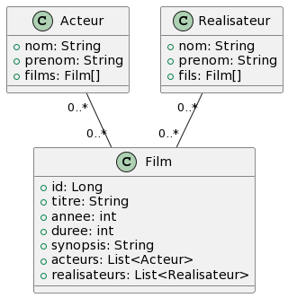

# Spring Boot

## Les Repository

 <!-- .element: width="20%" align="left"-->

 <!-- .element: width="40%" align="right"-->

----

## Repository

### Définition

- Couche d'accès aux données

- Permet de récupérer des données depuis une base de données

- Permet de créer, modifier et supprimer des données

----

## Repository

### Responsabilités

- Le repository est uniquement responsable de la persistance des données

- Il est appelé par la couche service

- Il échange des `entities` avec la couche service

----

## Repository

### Entity

- Une `entity` est une classe Java "classique"

- Elle représente généralement une table en base de données

- Elle ne contient que des attributs et des getters/setters

----

## Repository

### Configuration

Nous avons besoin de dépendances pour utiliser un repository :

- Spring Data JPA (ORM)
- Spring Data JDBC (Connecteur)
- Mysql Connector (Connecteur MySQL)

> Il existe également un connecteur mongoDB : Spring Data MongoDB

----

## Repository

### Configuration

- Créez un nouveau projet SpringBoot avec Maven nommé `Cinema`
- Ajoutez les dépendances suivantes :
    - Spring Web
    - Spring Data JPA
    - Spring Boot DevTools
    - Lombok
    - Spring Data JDBC
    - MySQL Connector

----

## Repository

### Création de la BDD

Démarrez le conteneur docker suivant

```yaml
version: '3.8'

services:
  mysql:
    image: mysql:8.0.27
    ports:
      - "3306:3306"
    environment:
      MYSQL_ROOT_PASSWORD: root
      MYSQL_DATABASE: cinema
      MYSQL_USER: cinemadmin
      MYSQL_PASSWORD: pass4cinemadmin 
```

----

## Repository

### Configuration

- Le fichier `application.properties` sert à paramétrer une application Spring Boot

- Il est situé dans `src/main/resources`

- Il peut contenir beaucoup de choses (base de données, port d'écoute, etc.)

- Cependant, le format est assez lourd

> Heureusement, on peut aussi utiliser le format YAML !

----

## Repository

### `application.yml`

- Renommez le fichier `application.properties` en `application.yml`

- Il faudra maintenant ajouter la configuration de la base de données !

----

## Repository

### `application.yml`

```yaml
# Attribution spring qui contient la configuration de Spring Boot
spring:
  data:
    jdbc:
      repositories:
        enabled: true
  # Configuration de la datasource
  datasource:
    # Url de la datasource
    # On y ajoute quelques paramètres pour éviter des erreurs
    url: jdbc:mysql://localhost:3306/cinema?serverTimezone=UTC&useSSL=false&allowPublicKeyRetrieval=true
    # serverTimezone : fuseau horaire
    # useSSL : désactive le SSL
    # allowPublicKeyRetrieval : autorise la récupération de la clé publique (pour se loguer)
    username: cinemadmin
    password: pass4cinemadmin
  # Configuration de JPA
  jpa:
    # Dialecte de la base de données
    hibernate:
      ddl-auto: update
      # Permet d'afficher les requêtes SQL dans la console
    show-sql: true
# Paramètres du serveur
server:
  # Gestion des erreurs
  error:
    include-stacktrace: never
  # Port d'écoute
  port: 8080
```

----

## Repository

### Le projet

Nous allons réaliser une application de films !



----

## CRUD Films

### Entité Film

- On commence généralement par créer l'entité.

- À partir de cette entité, Spring va automatiquement créer la table en base de données !

- Créez une classe `Film` dans le package `fr.octocorn.democoursapi.cinema.films`

----

## CRUD Films

### Entité Film

Nous allons d'abord créer les films, sans se soucier des relations.

```java [0]
// Déclare la classe comme étant une entité
@Entity
@Getter
@Setter
@ToString
@NoArgsConstructor
@Table(name = "film")
public class Film {
    // Déclare comme étant la clé primaire
    @Id
    // Auto-increment (auto-généré)
    @GeneratedValue
    private Integer id;

    // Déclare que c'est une colonne, et qu'elle ne peut pas être nulle
    @Column(nullable = false)
    private String titre;

    @Column(nullable = false)
    private LocalDate dateSortie;

    @Column(nullable = false)
    private int duree;

    // Déclare que la colonne peut contenir jusqu'à 500 caractères
    @Column(length = 500)
    private String synopsis;

}
```

----

## CRUD Films

### Import

> ⚠️ import depuis `jakarta.persistence` ⚠️

----

## CRUD Films

### Création du repository

Les méthodes présentes dans un repository suivent une norme de nommage :

- `findAll` : Récupère tous les éléments

- `findById` : Récupère un élément par son id

- `save` : Sauvegarde un élément

- `deleteById` : Supprime un élément par son id

- `update` : Met à jour un élément

----

## CRUD Films

### Création du repository

- Créez une interface `FilmRepository` dans le package `fr.octocorn.democoursapi.cinema.films.repository`

- Nous allons dans un premier temps utiliser un repository classique

----

## CRUD Films

### Création du repository

```java [0]

@Repository
@Transactional
public class FilmRepository {
    private final EntityManager entityManager; // Gestionnaire d'entités de JPA

    public FilmRepository(EntityManager entityManager) {
        this.entityManager = entityManager;
    }

    /**
     * Récupère tous les films
     * @return la liste des films
     */
    public List<Film> findAll() {
        // Permet d'exécuter une requête SQL en JPQL (Java Persistence Query Language)
        return entityManager.createQuery("SELECT f FROM Film f", Film.class).getResultList();
    }
}
```

----

## CRUD Films

### Création du service

```java [0]

@Service
public class FilmService {
    private final FilmRepository filmRepository;

    public FilmService(FilmRepository filmRepository) {
        this.filmRepository = filmRepository;
    }

    public List<Film> findAll() {
        return filmRepository.findAll();
    }
}
```

----

## CRUD Films

### Création du controller

```java [0]

@RestController
@RequestMapping("/films")
public class FilmController {
    private final FilmService filmService;

    public FilmController(FilmService filmService) {
        this.filmService = filmService;
    }

    @GetMapping
    public List<Film> findAll() {
        return filmService.findAll();
    }
}
```

----

## CRUD Films

### Vérification

- Relancez le projet Spring Boot

- Ouvrez MySQL Workbench : Une table a été créée !

- Ouvrez Postman : Vous pouvez maintenant récupérer les films !

> La liste est vide, il nous faut créer des films !

----

## CRUD Films

### Création de films

Pour créer des films, nous devront ajouter une méthode `save` dans le repository :

```java [26-39]

@Repository
// Permet de gérer les transactions
@Transactional
public class FilmRepository {
    private final EntityManager entityManager;

    public FilmRepository(EntityManager entityManager) {
        this.entityManager = entityManager;
    }

    public List<Film> findAll() {
        return entityManager.createQuery("SELECT f FROM Film f", Film.class).getResultList();
    }

    /**
     * Récupère tous les films
     * @return la liste des films
     */
    public List<Film> findAll() {
        // Permet d'exécuter une requête SQL en JPQL (Java Persistence Query Language)
        return entityManager.createQuery("SELECT f FROM Film f", Film.class).getResultList();
    }


    /**
     * Sauvegarde un film dans la base de données
     * @param film à sauvegarder
     * @return le film sauvegardé avec son id
     */
    public Film save(Film film) {
        // Persiste l'entité dans la base de données
        // Exécute la requête SQL suivante :
        // INSERT INTO film (titre, date_sortie, duree, synopsis) VALUES (?, ?, ?, ?)
        entityManager.persist(film);
        // Synchro de l'instance avec la base de données (et ajoute l'ID)
        entityManager.flush();
        return film;
    }
}
```

----

## CRUD Films

### Méthodes

- Cette fois-ci, nous n'avons pas créé de requêtes nous même

- Nous avons utilisé des méthodes de l'EntityManager

- Il existe beaucoup de méthodes pour manipuler les entités !

----

## CRUD Films

### Création de films

On peut maintenant créer une méthode dans le service pour créer des films

```java [14-16]

@Service
public class FilmService {
    private final FilmRepository filmRepository;

    public FilmService(FilmRepository filmRepository) {
        this.filmRepository = filmRepository;
    }

    public List<Film> findAll() {
        return filmRepository.findAll();
    }

    public Film save(Film film) {
        return filmRepository.save(film);
    }
}
```

----

## CRUD Films

### Création de films

On peut maintenant créer une méthode dans le controller pour créer des films

```java [16-19]

@RestController
@RequestMapping("/films")
public class FilmController {
    private final FilmService filmService;

    public FilmController(FilmService filmService) {
        this.filmService = filmService;
    }

    @GetMapping
    public List<Film> findAll() {
        return filmService.findAll();
    }

    @PostMapping
    public Film save(@RequestBody Film film) {
        return filmService.save(film);
    }
}
```

----

## CRUD Films

### Vérification

- Relancez le projet Spring Boot

- Réalisez un POST avec ne body suivant :

```json
{
  "titre": "Star Wars",
  "dateSortie": "1977-05-25",
  "duree": 121,
  "synopsis": "Il y a bien longtemps, dans une galaxie très lointaine..."
}
```

- Après un GET, vous devriez voir le film !

----

## CRUD Films

### Rechercher un film par son id

Dans le repository :

```java [35-45]

@Repository
@Transactional
public class FilmRepository {
    private final EntityManager entityManager; // Gestionnaire d'entités de JPA

    public FilmRepository(EntityManager entityManager) {
        this.entityManager = entityManager;
    }

    /**
     * Récupère tous les films
     * @return la liste des films
     */
    public List<Film> findAll() {
        // Permet d'exécuter une requête SQL en JPQL (Java Persistence Query Language)
        return entityManager.createQuery("SELECT f FROM Film f", Film.class).getResultList();
    }

    /**
     * Sauvegarde un film dans la base de données
     * @param film à sauvegarder
     * @return le film sauvegardé avec son id
     */
    public Film save(Film film) {
        // Persiste l'entité dans la base de données
        // Exécute la requête SQL suivante :
        // INSERT INTO film (titre, date_sortie, duree, synopsis) VALUES (?, ?, ?, ?)
        entityManager.persist(film);
        // Synchro de l'instance avec la base de données (et ajoute l'ID)
        entityManager.flush();
        return film;
    }

    /**
     * Récupère un film par son id
     * @param id du film
     * @return le film
     */
    public Film findById(Integer id) {
        // Retourne l'entité correspondant à l'id
        // Exécute la requête SQL suivante :
        // SELECT * FROM film WHERE id = id
        return entityManager.find(Film.class, id);
    }
}
```

----

## CRUD Films

### Rechercher un film par son id

Dans le service :

```java [18-20]

@Service
public class FilmService {
    private final FilmRepository filmRepository;

    public FilmService(FilmRepository filmRepository) {
        this.filmRepository = filmRepository;
    }

    public List<Film> findAll() {
        return filmRepository.findAll();
    }

    public Film save(Film film) {
        return filmRepository.save(film);
    }

    public Film findById(Integer id) {
        return filmRepository.findById(id);
    }
}
```

----

## CRUD Films

### Rechercher un film par son id

Dans le controller :

```java [21-24]

@RestController
@RequestMapping("/films")
public class FilmController {
    private final FilmService filmService;

    public FilmController(FilmService filmService) {
        this.filmService = filmService;
    }

    @GetMapping
    public List<Film> findAll() {
        return filmService.findAll();
    }

    @PostMapping
    public Film save(@RequestBody Film film) {
        return filmService.save(film);
    }

    @GetMapping("/{id}")
    public Film findById(@PathVariable Integer id) {
        return filmService.findById(id);
    }
}
```

----

## CRUD Films

### Vérification

- Relancez le projet Spring Boot

- Réalisez un GET avec l'id 1 : Vous devriez voir le film !

> Mais que se passe-t-il si l'id n'existe pas ?

----

## CRUD Films

### Les optionnels

- Un objet optionnel permet de gérer les valeurs nulles

- Il permet de gérer les erreurs de manière plus propre

- C'est une classe générique qui peut contenir une valeur ou rien du tout

> Syntaxe : `Optional<Type>`

----

## CRUD Films

### Rework du findById

```java [35-45]

@Repository
@Transactional
public class FilmRepository {
    private final EntityManager entityManager; // Gestionnaire d'entités de JPA

    public FilmRepository(EntityManager entityManager) {
        this.entityManager = entityManager;
    }

    /**
     * Récupère tous les films
     * @return la liste des films
     */
    public List<Film> findAll() {
        // Permet d'exécuter une requête SQL en JPQL (Java Persistence Query Language)
        return entityManager.createQuery("SELECT f FROM Film f", Film.class).getResultList();
    }

    /**
     * Sauvegarde un film dans la base de données
     * @param film à sauvegarder
     * @return le film sauvegardé avec son id
     */
    public Film save(Film film) {
        // Persiste l'entité dans la base de données
        // Exécute la requête SQL suivante :
        // INSERT INTO film (titre, date_sortie, duree, synopsis) VALUES (?, ?, ?, ?)
        entityManager.persist(film);
        // Synchro de l'instance avec la base de données (et ajoute l'ID)
        entityManager.flush();
        return film;
    }

    /**
     * Récupère un film par son id
     * @param id du film
     * @return le film
     */
    public Optional<Film> findById(Integer id) {
        // Retourne l'entité correspondant à l'id
        // Exécute la requête SQL suivante :
        // SELECT * FROM film WHERE id = id
        return Optional.ofNullable(entityManager.find(Film.class, id));
    }
}
```

----

## CRUD Films

### Rework du findById

```java [18-30]

@Service
public class FilmService {
    private final FilmRepository filmRepository;

    public FilmService(FilmRepository filmRepository) {
        this.filmRepository = filmRepository;
    }

    public List<Film> findAll() {
        return filmRepository.findAll();
    }

    public Film save(Film film) {
        return filmRepository.save(film);
    }

    public Film findById(int id) {
        return filmRepository.findById(id)
                // Méthode qui permet de récupérer la valeur si elle existe
                // Si elle n'existe pas, exécutera la lamba
                .orElseThrow(
                        // Retournera une exception avec un message d'erreur 
                        // "Film non trouvé"
                        // Ainsi qu'un code HTTP 404
                        () -> new ResponseStatusException(HttpStatus.NOT_FOUND,
                                "Film non trouvé"
                        )
                );
    }
}
```

----

## CRUD Films

### Delete by id

```java [58-66]

@Repository
@Transactional
public class FilmRepository {
    private final EntityManager entityManager; // Gestionnaire d'entités de JPA

    public FilmRepository(EntityManager entityManager) {
        this.entityManager = entityManager;
    }

    /**
     * Récupère tous les films
     * @return la liste des films
     */
    public List<Film> findAll() {
        // Permet d'exécuter une requête SQL en JPQL (Java Persistence Query Language)
        return entityManager.createQuery("SELECT f FROM Film f", Film.class).getResultList();
    }

    /**
     * Sauvegarde un film dans la base de données
     * @param film à sauvegarder
     * @return le film sauvegardé avec son id
     */
    public Film save(Film film) {
        // Persiste l'entité dans la base de données
        // Exécute la requête SQL suivante :
        // INSERT INTO film (titre, date_sortie, duree, synopsis) VALUES (?, ?, ?, ?)
        entityManager.persist(film);
        // Synchro de l'instance avec la base de données (et ajoute l'ID)
        entityManager.flush();
        return film;
    }

    /**
     * Récupère un film par son id
     * @param id du film
     * @return le film
     */
    public Optional<Film> findById(Integer id) {
        // Retourne l'entité correspondant à l'id
        // Exécute la requête SQL suivante :
        // SELECT * FROM film WHERE id = id
        return Optional.ofNullable(entityManager.find(Film.class, id));
    }

    /**
     * Met à jour un film dans la bdd
     * @param film à mettre à jour
     * @return le film mis à jour
     */
    public Film update(Film film) {
        // Exécute la requête SQL suivante :
        // UPDATE film SET titre = ?, date_sortie = ?, duree = ?, synopsis = ? WHERE id = ?
        return entityManager.merge(film);
    }

    /**
     * Supprime un film de la bdd
     * @param  id du film à supprimer
     */
    public void deleteById(Integer id) {
        // Exécute la requête SQL suivante :
        // DELETE FROM film WHERE id = ?
        entityManager.remove(findById(id));
    }

}
```

----

## CRUD Films

### Delete by id

```java [29-31]

@Service
public class FilmService {
    private final FilmRepository filmRepository;

    public FilmService(FilmRepository filmRepository) {
        this.filmRepository = filmRepository;
    }

    public List<Film> findAll() {
        return filmRepository.findAll();
    }

    public Film save(Film film) {
        return filmRepository.save(film);
    }

    public Film findById(int id) {
        return filmRepository.findById(id)
                // Méthode qui permet de récupérer la valeur si elle existe
                // Si elle n'existe pas, exécutera la lamba
                .orElseThrow(
                        // En l'occurenbce, retournera une exception avec un message d'erreur "Film non trouvé"
                        // Ainsi qu'un code HTTP 404
                        () -> new ResponseStatusException(HttpStatus.NOT_FOUND, "Film non trouvé")
                );
    }

    public void deleteById(int id) {
        filmRepository.deleteById(id);
    }
}
```

----

## CRUD Films

### Delete by id

```java [26-29]

@RestController
@RequestMapping("/films")
public class FilmController {
    private final FilmService filmService;

    public FilmController(FilmService filmService) {
        this.filmService = filmService;
    }

    @GetMapping
    public List<Film> findAll() {
        return filmService.findAll();
    }

    @PostMapping
    public Film save(@RequestBody Film film) {
        return filmService.save(film);
    }

    @GetMapping("/{id}")
    public Film findById(@PathVariable int id) {
        return filmService.findById(id);
    }

    @DeleteMapping("/{id}")
    public void deleteById(@PathVariable int id) {
        filmService.deleteById(id);
    }
}
```

----

## CRUD Films

### Vérification

- Relancez le projet Spring Boot

- Réalisez un DELETE avec l'id 1 : Vous devriez voir le film !

> Mais que se passe-t-il si l'id n'existe pas ?

----

## CRUD Films

### Delete by id

```java [29-34]

@Service
public class FilmService {
    private final FilmRepository filmRepository;

    public FilmService(FilmRepository filmRepository) {
        this.filmRepository = filmRepository;
    }

    public List<Film> findAll() {
        return filmRepository.findAll();
    }

    public Film save(Film film) {
        return filmRepository.save(film);
    }

    public Film findById(int id) {
        return filmRepository.findById(id)
                // Méthode qui permet de récupérer la valeur si elle existe
                // Si elle n'existe pas, exécutera la lamba
                .orElseThrow(
                        // En l'occurrence, retournera une exception avec un message d'erreur "Film non trouvé"
                        // Ainsi qu'un code HTTP 404
                        () -> new ResponseStatusException(HttpStatus.NOT_FOUND, "Film non trouvé")
                );
    }

    public void deleteById(int id) {
        // Appel de la méthode findById pour vérifier que le film existe
        this.findById(id);

        filmRepository.deleteById(id);
    }
}
```

----

## CRUD Films

### Update

```java [57-66]

@Repository
@Transactional
public class FilmRepository {
    private final EntityManager entityManager; // Gestionnaire d'entités de JPA

    public FilmRepository(EntityManager entityManager) {
        this.entityManager = entityManager;
    }

    /**
     * Récupère tous les films
     * @return la liste des films
     */
    public List<Film> findAll() {
        // Permet d'exécuter une requête SQL en JPQL (Java Persistence Query Language)
        return entityManager.createQuery("SELECT f FROM Film f", Film.class).getResultList();
    }

    /**
     * Sauvegarde un film dans la base de données
     * @param film à sauvegarder
     * @return le film sauvegardé avec son id
     */
    public Film save(Film film) {
        // Persiste l'entité dans la base de données
        // Exécute la requête SQL suivante :
        // INSERT INTO film (titre, date_sortie, duree, synopsis) VALUES (?, ?, ?, ?)
        entityManager.persist(film);
        // Synchro de l'instance avec la base de données (et ajoute l'ID)
        entityManager.flush();
        return film;
    }

    /**
     * Récupère un film par son id
     * @param id du film
     * @return le film
     */
    public Optional<Film> findById(Integer id) {
        // Retourne l'entité correspondant à l'id
        // Exécute la requête SQL suivante :
        // SELECT * FROM film WHERE id = id
        return Optional.ofNullable(entityManager.find(Film.class, id));
    }

    /**
     * Supprime un film de la bdd
     * @param  id du film à supprimer
     */
    public void deleteById(Integer id) {
        // Exécute la requête SQL suivante :
        // DELETE FROM film WHERE id = ?
        entityManager.remove(findById(id));
    }

    /**
     * Met à jour un film dans la bdd
     * @param film à mettre à jour
     * @return le film mis à jour
     */
    public Film update(Film film) {
        // Exécute la requête SQL suivante :
        // UPDATE film SET titre = ?, date_sortie = ?, duree = ?, synopsis = ? WHERE id = ?
        return entityManager.merge(film);
    }
}

```

----

## CRUD Films

### Update

```java [36-41]

@Service
public class FilmService {
    private final FilmRepository filmRepository;

    public FilmService(FilmRepository filmRepository) {
        this.filmRepository = filmRepository;
    }

    public List<Film> findAll() {
        return filmRepository.findAll();
    }

    public Film save(Film film) {
        return filmRepository.save(film);
    }

    public Film findById(int id) {
        return filmRepository.findById(id)
                // Méthode qui permet de récupérer la valeur si elle existe
                // Si elle n'existe pas, exécutera la lamba
                .orElseThrow(
                        // En l'occurrence, retournera une exception avec un message d'erreur "Film non trouvé"
                        // Ainsi qu'un code HTTP 404
                        () -> new ResponseStatusException(HttpStatus.NOT_FOUND, "Film non trouvé")
                );
    }

    public void deleteById(int id) {
        // Appel de la méthode findById pour vérifier que le film existe
        this.findById(id);

        filmRepository.deleteById(id);
    }

    public Film update(Film film) {
        // Appel de la méthode findById pour vérifier que le film existe
        this.findById(film.getId());

        return filmRepository.update(film);
    }
}
```

----

## CRUD Films

### Update

```java [31-34]

@RestController
@RequestMapping("/films")
public class FilmController {
    private final FilmService filmService;

    public FilmController(FilmService filmService) {
        this.filmService = filmService;
    }

    @GetMapping
    public List<Film> findAll() {
        return filmService.findAll();
    }

    @PostMapping
    public Film save(@RequestBody Film film) {
        return filmService.save(film);
    }

    @GetMapping("/{id}")
    public Film findById(@PathVariable int id) {
        return filmService.findById(id);
    }

    @DeleteMapping("/{id}")
    public void deleteById(@PathVariable int id) {
        filmService.deleteById(id);
    }

    @PutMapping
    public Film update(@RequestBody Film film) {
        return filmService.update(film);
    }
}
```

----

## CRUD Films

### Conclusion

- Les repositories sont très puissants, surtout avec JPA

- Vous noterez que nous n'avons pas écrit une seule requête SQL ! (sauf pour l'exemple)

- Nous avons utilisé des méthodes de l'EntityManager !

----

## CRUD Films

### Ceci dit ...

- Nous avons encore deux CRUD à créer pour les acteurs et les réalisateurs

- Ça veut dire que nous allons devoir refaire la même chose pour les deux autres entités ?

----

## CRUD Films

Et si je vous disais qu'on pouvait tout un répository, avec seulement **2 lignes** de code ?

---

# Spring Boot

## JpaRepositories

 <!-- .element: width="20%" align="left"-->

 <!-- .element: width="40%" align="right"-->

----

## JpaRepositories

### Définition

- Les JpaRepositories sont des interfaces qui permettent de manipuler des entités

- Contrairement aux repositories classiques, ils ne nécessitent pas d'implémentation

> Mais le code se fait tout seul ?!

----

## JpaRepositories

### Explications

- Pour avoir un répository généré automatiquement, il faut que l'interface hérite de `JpaRepository`

- Nous n'aurons rien de plus à coder à l'intérieur !

> De la magie noire !

----

## JpaRepositories

### Création du repository

- Renommez votre repository `FilmRepository` en `_FilmRepository`

- Commentez les annotations `@Repository` et `@Transactional`

- Créez un nouveau fichier : `FilmRepository.java`

- Remplacez l'import de `FilmRepository` dans `FilmService` par le nouveau.

----

## JpaRepositories

### Création du repository

```java [0]

public interface FilmRepository extends JpaRepository<Film, Integer> {
}
```

> 2 lignes, et c'est TOUT !

----

## JpaRepositories

### Adapter le service

- Après avoir changé l'import, nous devons adapter la méthode `update`

- En effet, le repository généré ne possède pas de méthode `update`

- Tout passe par la méthode `save` qui va mettre à jour l'entité si elle existe, ou la créer sinon

----

## JpaRepositories

### Adapter le service

```java [44]

@Service
public class FilmService {
    private final FilmRepository filmRepository;

    public FilmService(FilmRepository filmRepository) {
        this.filmRepository = filmRepository;
    }

    public List<Film> findAll() {
        return filmRepository.findAll();
    }

    public Film save(Film film) {
        return filmRepository.save(film);
    }

    public Film findById(int id) {
        return filmRepository.findById(id)
                // Méthode qui permet de récupérer la valeur si elle existe
                // Si elle n'existe pas, exécutera la lamba
                .orElseThrow(
                        // En l'occurenbce, retournera une exception avec un message d'erreur "Film non trouvé"
                        // Ainsi qu'un code HTTP 404
                        () -> new ResponseStatusException(HttpStatus.NOT_FOUND, "Film non trouvé")
                );
    }

    public void deleteById(int id) {
        // Appel de la méthode findById pour vérifier que le film existe
        this.findById(id);

        filmRepository.deleteById(id);
    }

    public Film update(Film film, int id) {
        // Appel de la méthode findById pour vérifier que le film existe
        this.findById(id);

        // On force l'id du film à mettre à jour
        // Sinon, merge en créera un nouveau
        film.setId(id);

        return filmRepository.save(film);
    }
}
```

----

## JpaRepositories

### Les méthodes

- Les JpaRepositories possèdent déjà beaucoup de méthodes.

- On compte les classiques `findAll`, `findById`, `save` et `deleteById`

> C'est déjà très pratique, mais ce n'est pas tout !

----

## JpaRepositories

### Méthodes avancées

> Comment faire si on souhaite récupérer les films par titre ?

----

## JpaRepositories

### Méthodes avancées

- Il est possible de définir (sans implémentation) des méthodes dans les JpaRepositories

- Elles seront automatiquement implémentées par Spring !

- Il suffit de respecter la norme de nommage : La norme JPA

----

## JpaRepositories

### Méthodes avancées

- La norme utilise les mots clés suivants :
    - `find` : Récupère un élément
    - `findBy` : Récupère un élément par un attribut
    - `findAllBy` : Récupère tous les éléments par un attribut
- On peut y ajouter `And` ou `Or` pour ajouter des conditions

----

## JpaRepositories

### Exemple

`FilmRepository.java`

```java [0]
public interface FilmRepository extends JpaRepository<Film, Integer> {
    // On retourne un optionnel car le film peut ne pas exister
    Optional<Film> findByTitre(String titre);
}
```

----

## JpaRepositories

### Exemple

`FilmService.java`

```java [38-42]

@Service
public class FilmService {
    private final FilmRepository filmRepository;

    public FilmService(FilmRepository filmRepository) {
        this.filmRepository = filmRepository;
    }

    public List<Film> findAll() {
        return filmRepository.findAll();
    }

    public Film save(Film film) {
        return filmRepository.save(film);
    }

    public Film findById(int id) {
        return filmRepository.findById(id)
                .orElseThrow(
                        () -> new ResponseStatusException(HttpStatus.NOT_FOUND, "Film non trouvé")
                );
    }

    public void deleteById(int id) {
        this.findById(id);

        filmRepository.deleteById(id);
    }

    public Film update(Film film, int id) {
        this.findById(id);
        film.setId(id);

        return filmRepository.save(film);
    }

    public Film findByTitre(String titre) {
        return filmRepository.findByTitre(titre).orElseThrow(
                () -> new ResponseStatusException(HttpStatus.NOT_FOUND, "Film non trouvé")
        );
    }
}
```

----

## JpaRepositories

### Controller

```java [36-39]

@RestController
@RequestMapping("/films")
public class FilmController {
    private final FilmService filmService;

    public FilmController(FilmService filmService) {
        this.filmService = filmService;
    }

    @GetMapping
    public List<Film> findAll() {
        return filmService.findAll();
    }

    @PostMapping
    public Film save(@RequestBody Film film) {
        return filmService.save(film);
    }

    @GetMapping("/{id}")
    public Film findById(@PathVariable int id) {
        return filmService.findById(id);
    }

    @DeleteMapping("/{id}")
    public void deleteById(@PathVariable int id) {
        filmService.deleteById(id);
    }

    @PutMapping("/{id}")
    public Film update(@RequestBody Film film, @PathVariable int id) {
        return filmService.update(film, id);
    }

    @GetMapping("/search")
    public Film findByTitre(@RequestParam String titre) {
        return filmService.findByTitre(titre);
    }
}
```

----

## JpaRepositories

### Vérification

- Relancez le projet Spring Boot

- Réalisez un GET avec le titre "Star Wars" : `http://localhost:8080/films/search?titre=Star%20Wars`

- Vous devriez récupérer le film !

> Magie !

----

## JpaRepositories

### Explications

- À partir du nom, Spring va générer la requête SQL

- Les `findBy` sont des `SELECT * FROM film WHERE ...`

- D'où l'importance de respecter la norme de nommage !

---

# Spring Boot

## Les relations

 <!-- .element: width="20%" align="left"-->

 <!-- .element: width="40%" align="right"-->

----

## Les relations

### Définition

- Dans la majorité des BDD relationnelles, il est possible de créer des relations entre les tables

- Il existe plusieurs types de relations :
    - OneToOne
    - OneToMany ou ManyToOne
    - ManyToMany

- Spring permet une implémentation simple de ces relations en se basant sur les entités

----

## Les relations

### Annotations

Pour chaque relation, il existe une annotation :

- `@OneToOne` : Définit une relation OneToOne
- `@OneToMany` : Définit une relation OneToMany
- `@ManyToOne` : Définit une relation ManyToOne
- `@ManyToMany` : Définit une relation ManyToMany

----

## Les relations

### OneToOne

- Une relation OneToOne est une relation où une entité est liée à une seule autre entité

- Cette relation est unique.

- Exemple : Un élève a un seul carnet de notes

----

## Les relations

### OneToOne

- Pour définir une relation OneToOne, il faut utiliser l'annotation `@OneToOne`

```java

@Entitiy
public class Eleve {
    @Id
    @GeneratedValue
    private Integer id;

    @OneToOne(cascade = CascadeType.ALL)
    private CarnetDeNotes carnetDeNotes;
}
```

- `cascade` permet de définir les actions à effectuer sur l'entité liée

----

## Les relations

### OneToOne

```java

@Entitiy
public class CarnetDeNotes {
    @Id
    @GeneratedValue
    private Integer id;

    private String appreciation;

    private int moyenne;
}
```

----

## Les relations

### OneToOne

`Repository`

```java [0]

public interface EleveRepository extends JpaRepository<Eleve, Integer> {
}
```

----

## Les relations

### OneToOne

`Service`

```java [0]

@Service
public class EleveService {
    private final EleveRepository eleveRepository;

    public EleveService(EleveRepository eleveRepository) {
        this.eleveRepository = eleveRepository;
    }

    public List<Eleve> findAll() {
        return eleveRepository.findAll();
    }

    public Eleve save(Eleve eleve) {
        return eleveRepository.save(eleve);
    }
}
```

----

## Les relations

### OneToOne

`Controller`

```java [0]

@RestController
@RequestMapping("/eleves")
public class EleveController {
    private final EleveService eleveService;

    public EleveController(EleveService eleveService) {
        this.eleveService = eleveService;
    }

    @GetMapping
    public List<Eleve> findAll() {
        return eleveService.findAll();
    }

    @PostMapping
    public Eleve save(@RequestBody Eleve eleve) {
        return eleveService.save(eleve);
    }
}
```

----

## Les relations

### OneToOne

On peut ainsi créer un élève et son carnet de notes en une seule requête :

```json
{
  "nom": "Doe",
  "prenom": "John",
  "carnetDeNotes": {
    "appreciation": "Très bon travail !",
    "moyenne": 18
  }
}
```

----

## Les relations

### ManyToOne

- Une relation ManyToOne est une relation où plusieurs entités sont liées à une seule autre entité

- Cette relation est unique, dans un seul sens

- Exemple : Un même réalisateur a plusieurs films, mais un film n'a qu'un seul réalisateur

----

## Les relations

### ManyToOne

Dans l'entité `Film` :

```java [29-36]

@Entity
@Getter
@Setter
@ToString
@NoArgsConstructor
@Table(name = "film")
public class Film {
    // Déclare comme étant la clé primaire
    @Id
    // Auto-increment (auto-généré)
    @GeneratedValue
    private Integer id;

    // Déclare que c'est une colonne, et qu'elle ne peut pas être nulle
    @Column(nullable = false)
    private String titre;

    @Column(nullable = false)
    private LocalDate dateSortie;

    @Column(nullable = false)
    private int duree;

    // Déclare que la colonne peut contenir jusqu'à 500 caractères
    @Column(length = 500)
    private String synopsis;

    // Many films to One réalisateur
    // One réalisateur to Many films
    @ManyToOne
    // Film stocke la clé étrangère (FK)
    // Realisateur stocke la clé primaire...
    // de la colonne de liaison (realisateur_id)
    @JoinColumn(name = "realisateur_id")
    private Realisateur realisateur;
}
```

----

## Les relations

### ManyToOne

Dans l'entité `Realisateur` :

```java [0]

@Entity
@Getter
@Setter
@NoArgsConstructor
@ToString
@Table(name = "realisateur")
public class Realisateur {
    @Id
    @GeneratedValue(strategy = GenerationType.AUTO)
    private Integer id;

    private String nom;

    private String prenom;
}
```

----

## Les relations

### ManyToOne

On peut ainsi créer un film et son réalisateur en une seule requête :

```json
{
  "titre": "Star Wars",
  "dateSortie": "1977-05-25",
  "duree": 121,
  "synopsis": "Il y a bien longtemps, dans une galaxie très lointaine...",
  "realisateur": {
    "nom": "Lucas",
    "prenom": "George"
  }
}
```

----

## Les relations

### ManyToOne

- Mais également créer un film et lier un réalisateur existant

```json
{
  "titre": "Star Wars",
  "dateSortie": "1977-05-25",
  "duree": 121,
  "synopsis": "Il y a bien longtemps, dans une galaxie très lointaine...",
  "realisateur": {
    "id": 1
  }
}
```

----

## Les relations

### ManyToOne

- Vous noterez que nous n'avons pas créé de repository pour Réalisateurs

- Ni de controller et service non plus

- À partir de la relation et des entités, Spring est capable de générer les requêtes SQL !

----

## Les relations

### ManyToOne

- L'attribut est donc stocké dans l'entité qui possède la clé étrangère

- Si on avait souhaité stocker l'attribut dans l'autre entité, on aurait pu utiliser `@OneToMany` dans `Realisateur`

----

## Les relations

### ManyToMany

- Une relation **ManyToMany** est une relation où plusieurs entités sont liées à plusieurs autres entités

- Cela passe par la création d'une table intermédiaire qui stockera les PK des deux entités

- Les entités elles, stockeront les FK de la table intermédiaire

----

## Les relations

### ManyToMany

Ici, nous allons ajouter la liste des acteurs dans l'entité `Film`

```java [29-41]

@Entity
@Getter
@Setter
@ToString
@NoArgsConstructor
@Table(name = "film")
public class Film {
    @Id
    @GeneratedValue
    private Integer id;

    @Column(nullable = false)
    private String titre;

    @Column(nullable = false)
    private LocalDate dateSortie;

    @Column(nullable = false)
    private int duree;

    @Column(length = 500)
    private String synopsis;

    @JoinColumn(name = "realisateur_id")
    @ManyToOne
    private Realisateur realisateur;

    @ManyToMany(cascade = CascadeType.PERSIST)
    @JoinTable(
            // Nom de la table de liaison
            name = "acteur_film",
            // Spécifie le nom de la colonne de liaison (FK) pour la table courante
            // Qui sera dans la table de liaison
            joinColumns = @JoinColumn(name = "film_id"),
            // Spécifie le nom de la colonne de liaison (FK) pour la table liée
            // Qui sera dans la table de liaison
            inverseJoinColumns = @JoinColumn(name = "acteur_id")
    )
    private List<Acteur> acteurs = new ArrayList<>();
}
```

----

## Les relations

### ManyToMany

Puis, créons l'entité acteurs :

```java [0 | 17-21]

@Entity
@Getter
@Setter
@Table(name = "acteur")
@NoArgsConstructor
public class Acteur {
    @Id
    @GeneratedValue(strategy = GenerationType.AUTO)
    @Column(name = "id", nullable = false)
    private Integer id;

    private String nom;

    private String prenom;

    // Spécifie le type de relation - 
    // Un acteur peut jouer dans plusieurs films (Many acteurs to Many films)
    // C'est l'attribut "acteurs" de l'entité Film qui stockera la clé étrangère
    @ManyToMany(mappedBy = "acteurs", cascade = CascadeType.PERSIST)
    private List<Film> films = new ArrayList<>();
}
```

----

## Les relations

### ManyToMany

Nous pouvons réaliser un POST suivant :

```json
{
  "titre": "Star Wars",
  "dateSortie": "1977-05-25",
  "duree": 121,
  "synopsis": "Il y a bien longtemps, dans une galaxie très lointaine...",
  "realisateur": {
    "nom": "Lucas",
    "prenom": "George"
  },
  "acteurs": [
    {
      "nom": "Ford",
      "prenom": "Harrison"
    },
    {
      "nom": "Fisher",
      "prenom": "Carrie"
    },
    {
      "nom": "Hamill",
      "prenom": "Mark"
    }
  ]
}
```

----

## Les relations

### ManyToMany

- Seulement, au moment de réaliser un GET sur le film, nous avons une erreur !

- En effet, nous sommes dans une **boucle infinie** !

- Un acteur a des films, qui ont des acteurs, qui ont des films, etc...

----

## Les relations

### ManyToMany

- Pour éviter cela, nous allons utiliser l'annotation `@JsonIdentityInfo`

- Elle permet d'indiquer à Spring de ne retourner que l'id de l'entité au lieu de l'entité complète

- Ainsi, nous n'aurons plus de boucle infinie !

----

## Les relations

### ManyToMany

```java [8]

@Entity
@Getter
@Setter
@ToString
@NoArgsConstructor
@Table(name = "film")
@JsonIdentityInfo(generator = ObjectIdGenerators.PropertyGenerator.class, property = "id")
public class Film {
    @Id
    @GeneratedValue
    private Integer id;

    @Column(nullable = false)
    private String titre;

    @Column(nullable = false)
    private LocalDate dateSortie;

    @Column(nullable = false)
    private int duree;

    @Column(length = 500)
    private String synopsis;

    @JoinColumn(name = "realisateur_id")
    @ManyToOne
    private Realisateur realisateur;

    @ManyToMany(cascade = CascadeType.PERSIST)
    @JoinTable(
            // Nom de la table de liaison
            name = "acteur_film",
            // Spécifie le nom de la colonne de liaison (FK) pour la table courante
            // Qui sera dans la table de liaison
            joinColumns = @JoinColumn(name = "film_id"),
            // Spécifie le nom de la colonne de liaison (FK) pour la table liée
            // Qui sera dans la table de liaison
            inverseJoinColumns = @JoinColumn(name = "acteur_id")
    )
    private List<Acteur> acteurs = new ArrayList<>();
}
```

----

## Les relations

### ManyToMany

```java [7]

@Entity
@Getter
@Setter
@Table(name = "acteur")
@NoArgsConstructor
@JsonIdentityInfo(generator = ObjectIdGenerators.PropertyGenerator.class, property = "id")
public class Acteur {
    @Id
    @GeneratedValue(strategy = GenerationType.AUTO)
    @Column(name = "id", nullable = false)
    private Integer id;

    private String nom;

    private String prenom;

    // Spécifie le type de relation - Un acteur peut jouer dans plusieurs films (Many acteurs to Many films)
    @ManyToMany(mappedBy = "acteurs", cascade = CascadeType.PERSIST)
    // Spécifie le nom de la table de liaison

    private List<Film> films = new ArrayList<>();
}
```

----

## Les relations

### ManyToMany

- Maintenant, nous pouvons récupérer le film sans problème !

- En revanche, nous récupérons un attribut `Films` dans l'entité `Acteur` qui comporte une liste d'ID.

- Nous pouvons faire mieux !

> D'après vous, comment ?

----

## Les relations

### ManyToMany

- Réponse : en utilisant des DTO !

- Mais avant, à vous d'implémenter le CRUD pour les acteurs et les réalisateurs :
    - `POST /acteurs`, `GET /acteurs`, `GET /acteurs/{id}`, `PUT /acteurs/{id}`, `DELETE /acteurs/{id}`
    - `POST /realisateurs`, `GET /realisateurs`, `GET /realisateurs/{id}`, `PUT /realisateurs/{id}`, `DELETE /realisateurs/{id}`

---

# Spring Boot

## DTO : Le retour

 <!-- .element: width="20%" align="left"-->

 <!-- .element: width="40%" align="right"-->

----

## DTO

### Rappels

- Les DTO permettent de définir la structure des objets échangés antre les clients et le serveur

- Nous avons déjà utilisé une DTO "d'entrée" avec notre calculatrice

- Il est aussi possible d'adapter la forme des objets qui sont retournés !

----

## DTO

### Création

`cinema.dto.FilmReduitDto`

```java [0]

@Data
public class FilmReduitDto {
    private Integer id;

    private String titre;

    private LocalDate dateSortie;

    private int duree;
}
```

----

## DTO

### Conversion Entity -> DTO

- Pour pouvoir utiliser la DTO, nous allons devoir mapper les entités vers les DTO

- Cette conversion peut se faire soit dans le service, soit dans le controller

- Chaque approche a ses avantages/inconvénients

----

## DTO

### Conversion Entity -> DTO

- Ici, nous allons réaliser la conversion dans le controller

- Nous aurons besoin d'une classe qui permet de mapper les entités vers les DTO : `ObjectMapper`

----

## DTO

### `ObjectMapper`

- Classe livrée avec Spring

- Contient des méthodes pour mapper des objets, les sérialiser, les désérialiser, etc...

- Elle doit être injectée en tant que dépendance

----

## DTO

### `ObjectMapper`

```java [0]

@RestController
@RequestMapping("/films")
public class FilmController {
    private final FilmService filmService;

    private final ObjectMapper objectMapper;

    public FilmController(FilmService filmService, ObjectMapper objectMapper) {
        this.filmService = filmService;
        this.objectMapper = objectMapper;
    }
    // code ...
}
```

----

## DTO

### Conversion Entity -> DTO

Conversion :

```java [0]

@RestController
@RequestMapping("/films")
public class FilmController {
    private final FilmService filmService;

    // Création d'un attribut pour stocker l'objet mapper
    private final ObjectMapper objectMapper;

    // Injection du mapper en tant que dépendance
    public FilmController(FilmService filmService, ObjectMapper objectMapper) {
        this.filmService = filmService;
        this.objectMapper = objectMapper;
    }

    @GetMapping
    // Modification du type de retour de la méthode
    public List<FilmReduitDto> findAll() {

        return filmService
                .findAll()
                // On parcours la liste des films
                // stream() permet de créer un stream à partir de la liste
                // C'est ce qui rend notre liste itérable
                // puis on map chaque film en DTO
                .stream().map(
                        // Puis, on convertit chaque film en DTO
                        // Via la méthode convertValue de l'object mapper
                        // Elle prend en paramètre l'entité puis la classe de destination
                        film -> objectMapper.convertValue(film, FilmReduitDto.class)
                        // Enfin, on récupère le stream et on le convertit en liste
                ).toList();
    }

    @PostMapping
    public Film save(@RequestBody Film film) {
        return filmService.save(film);
    }

    @GetMapping("/{id}")
    public Film findById(@PathVariable int id) {
        return filmService.findById(id);
    }

    @DeleteMapping("/{id}")
    public void deleteById(@PathVariable int id) {
        filmService.deleteById(id);
    }

    @PutMapping("/{id}")
    public Film update(@RequestBody Film film, @PathVariable int id) {
        return filmService.update(film, id);
    }

    @GetMapping("/search")
    public Film findByTitre(@RequestParam String titre) {
        return filmService.findByTitre(titre);
    }
}
```

----

## DTO

### Vérification

`GET /films` :

```json
[
  {
    "id": 1,
    "titre": "Star Wars",
    "dateSortie": "1977-05-25",
    "duree": 121
  }
]

```

----

## DTO

### Conclusion

- Nous avons maintenant une liste de films réduits

- Il nous reste encore à travailler sur les détails des films

- Nous ferons en sorte que `GET /films/{id}` retourne un film complet

- Mais, sans que les acteurs aient de liste de films !

----

## DTO

### Création

`cinema.acteurs.ActeurSansFilmDto`

```java [0]

@Data
public class ActeurSansFilmDto {
    private Integer id;

    private String nom;

    private String prenom;
}
```

----

## DTO

### Création

`cinema.films.FilmCompletDto`

```java [0]

@Data
public class FilmCompletDto {
    private Integer id;

    private String titre;

    private LocalDate dateSortie;

    private int duree;

    private String synopsis;

    private RealisateurDto realisateur;

    private List<ActeurSansFilmDto> acteurs = new ArrayList<>();
}
```

----

## DTO

### Conversion Entity -> DTO

```java [0]

@RestController
@RequestMapping("/films")
public class FilmController {
    private final FilmService filmService;

    private final ObjectMapper objectMapper;

    public FilmController(FilmService filmService, ObjectMapper objectMapper) {
        this.filmService = filmService;
        this.objectMapper = objectMapper;
    }

    @GetMapping
    public List<FilmReduitDto> findAll() {
        return filmService
                .findAll()
                .stream().map(
                        film -> objectMapper.convertValue(film, FilmReduitDto.class)
                ).toList();
    }

    @PostMapping
    public Film save(@RequestBody Film film) {
        return filmService.save(film);
    }

    @GetMapping("/{id}")
    public FilmCompletDto findById(@PathVariable int id) {
        Film film = filmService.findById(id);
        return objectMapper.convertValue(film, FilmCompletDto.class);
    }

    @DeleteMapping("/{id}")
    public void deleteById(@PathVariable int id) {
        filmService.deleteById(id);
    }

    @PutMapping("/{id}")
    public Film update(@RequestBody Film film, @PathVariable int id) {
        return filmService.update(film, id);
    }

    @GetMapping("/search")
    public Film findByTitre(@RequestParam String titre) {
        return filmService.findByTitre(titre);
    }
}
```

---

# Spring Boot

## Améliorations - Create  film

 <!-- .element: width="20%" align="left"-->

 <!-- .element: width="40%" align="right"-->

----

## Création sans répétition

### Problème

Avec le post suivant, nous avons une erreur :

```json
{
  "titre": "Star Wars : L'Empire contre-attaque",
  "dateSortie": "1980-05-21",
  "duree": 124,
  "synopsis": "L'épisode 5 !",
  "realisateur": {
    "id": 1
  },
  "acteurs": [
    {
      "id": 1
    },
    {
      "id": 2
    },
    {
      "id": 3
    },
    {
      "id": 4
    }
  ]
}
```

----

## Création sans répétition

### Solution

- En effet, nous essayons de passer une entité dite "détachée" à la méthode `save`

- Ayant mis en place le paramètre `CascadeType.PERSIST`, Spring essaye de persister les acteurs, bien qu'ils existent
  déjà

----

## Création sans répétition

### Solution

Pour ce faire, nous avons juste à retirer le paramètre `CascadeType.PERSIST` :

```java [30]

@Entity
@Getter
@Setter
@ToString
@NoArgsConstructor
@Table(name = "film")
@JsonIdentityInfo(generator = ObjectIdGenerators.PropertyGenerator.class, property = "id")
public class Film {
    @Id
    @GeneratedValue(strategy = GenerationType.AUTO)
    private Integer id;

    @Column(nullable = false)
    private String titre;

    @Column(nullable = false)
    private LocalDate dateSortie;

    @Column(nullable = false)
    private int duree;

    @Column(length = 500)
    private String synopsis;

    @JoinColumn(name = "realisateur_id")
    @ManyToOne
    private Realisateur realisateur;

    @ManyToMany
    @JoinTable(
            // Nom de la table de liaison
            name = "acteur_film",
            // Spécifie le nom de la colonne de liaison (FK) pour la table courante
            joinColumns = @JoinColumn(name = "film_id"),
            // Spécifie le nom de la colonne de liaison (FK) pour la table liée
            inverseJoinColumns = @JoinColumn(name = "acteur_id")
    )
    private List<Acteur> acteurs = new ArrayList<>();
}
```

----

## Création sans répétition

### Solution

```java [20]

@Getter
@Setter
@Table(name = "acteur")
@NoArgsConstructor
// Permet de gérer les boucles infinies
// Ici, un acteur a des films, qui a des acteurs, qui ont des films ...
@JsonIdentityInfo(generator = ObjectIdGenerators.PropertyGenerator.class, property = "id")
@ToString
public class Acteur {
    @Id
    @GeneratedValue(strategy = GenerationType.AUTO)
    private Integer id;

    private String nom;

    private String prenom;

    // Spécifie le type de relation - Un acteur peut jouer dans plusieurs films (Many acteurs to Many films)
    @ManyToMany(mappedBy = "acteurs")
    // Spécifie le nom de la table de liaison
    private List<Film> films = new ArrayList<>();
}

```

----

## Création sans répétition

### Solution

En revanche, nous ne pourrons plus faire ça :

```json
{
    "titre": "Star Wars : L'Empire contre-attaque",
    "dateSortie": "1980-05-21",
    "duree": 124,
    "synopsis": "L'épisode 5 !",
    "realisateur": {
        "nom": "Kershner",
        "prenom": "Irvin"
    },
    "acteurs": [
        {
            "nom": "Ford",
            "prenom": "Harrison"
        },
        {
            "nom": "Fisher",
            "prenom": "Carrie"
        },
        {
            "nom": "Hamill",
            "prenom": "Mark"
        },
        {
            "nom": "Williams",
            "prenom": "Billy Dee"
        }
    ]
}
```

----

## Création sans répétition

### Usage

- Cependant, ce n'est pas un usage courant (pas RESTFUL du tout)

- En effet, dans une application web, les données sont souvent fournies par un formulaire

- On aura un formulaire pour les acteurs qui réalisera son propre POST

- Jamais un POST pour la totalité !

----

## À vous de jouer !

Réalisez le TP 3

---

# Spring Boot

## HTTP Status et Exceptions

 <!-- .element: width="20%" align="left"-->

 <!-- .element: width="40%" align="right"-->

----

## Les Exceptions

### Définition

- Les exceptions sont primordiales dans une application

- C'est grâce à elles que nous pouvons gérer les erreurs

- En revanche, si on se contente de throw des exceptions, nous n'aurons pas le bon message HTTP.

----

## Les Exceptions

### Exemple

Avec ce code, nous aurons une erreur 500 !

```java
@Service
class FilmService {
    private final FilmRepository filmRepository;

    public FilmService(FilmRepository filmRepository) {
        this.filmRepository = filmRepository;
    }

    public Film createFilm(Film film) {
        if (film.getTitre() == null) {
            throw new RuntimeException("Le titre ne peut pas être null");
        }

        return filmRepository.save(film);
    }
}
```

----

## Les Exceptions

### Expceptions Spring Boot

- Heureusement, Spring nous offre la possibilité de créer des exceptions HTTP

- Nous avons un décorateur `@ResponseStatus` qui permet de définir le code HTTP

- On peut le placer sur une classe exception ou sur une méthode

----

## Les Exceptions

### Améliorons les films

- Nous allons créer une exception `FilmNotFoundException`

- Elle sera lancée si un film n'est pas trouvé

----

## Les Exceptions

### `FilmNotFoundException`

```java [0]

@ResponseStatus(HttpStatus.NOT_FOUND)
public class FilmNotFoundException extends RuntimeException {
    public FilmNotFoundException(String message) {
        super(message);
    }
}
```

----

## Les Exceptions

### `FilmService`

```java [24]

@Service
public class FilmService {
    private final FilmRepository filmRepository;

    private final ActeurService acteurService;
    public FilmService(FilmRepository filmRepository, ActeurService acteurService) {
        this.filmRepository = filmRepository;
        this.acteurService = acteurService;
    }

    public List<Film> findAll() {
        return filmRepository.findAll();
    }

    public Film save(Film film) {
        return filmRepository.save(film);
    }


    public Film findById(Integer id) {
        return filmRepository.findById(id)
                .orElseThrow(
                        () -> new FilmNotFoundException("Film non trouvé")
                );
    }

    public void deleteById(Integer id) {
        this.findById(id);

        filmRepository.deleteById(id);
    }

    public Film update(Film film, Integer id) {

        this.findById(id);
        
        film.setId(id);

        return filmRepository.save(film);
    }

    public Film findByTitre(String titre) {
        return filmRepository.findByTitre(titre).orElseThrow(
                () -> new ResponseStatusException(HttpStatus.NOT_FOUND, "Film non trouvé")
        );
    }

    public List<Acteur> findActeursByFilmId(Integer id) {
        Film film = this.findById(id);
        return film.getActeurs();
    }

    public Realisateur findRealisateurByFilmId(Integer id) {
        Film film = this.findById(id);
        return film.getRealisateur();
    }

    public List<Film> findByRealisateurId(Integer id) {
        return filmRepository.findByRealisateurId(id);
    }

    public Film addActeur(Integer id, Acteur acteur) {
        // On recherche notre film par son id
        Film film = this.findById(id);

        // On vérifie que l'acteur existe
        acteurService.findById(acteur.getId());

        // On ajoute l'acteur à la liste des acteurs du film
         film.getActeurs().add(acteur);

        return filmRepository.save(film);
    }

}
```

----

## Les Exceptions

### Bad request

- Erreur généralement retournée si les données d'un POST ou PUT ne sont pas correctes

- Actuellement, nous n'avons aucune vérification en place

- Nous allons donc ajouter des vérifications

----

## Les Exceptions

### `BadRequestException`

```java [0]

@ResponseStatus(HttpStatus.BAD_REQUEST)
public class BadRequestException extends RuntimeException {
    public BadRequestException(String message) {
        super(message);
    }
}
```

----

## Les Exceptions

### `FilmService`

```java [16-30]

@Service
public class FilmService {
    private final FilmRepository filmRepository;

    private final ActeurService acteurService;
    public FilmService(FilmRepository filmRepository, ActeurService acteurService) {
        this.filmRepository = filmRepository;
        this.acteurService = acteurService;
    }

    public List<Film> findAll() {
        return filmRepository.findAll();
    }

    public Film save(Film film) {
        if (film.getTitre() == null) {
            throw new BadRequestException("Le titre est obligatoire");
        }

        if (film.getDateSortie() == null) {
            throw new BadRequestException("La date de sortie est obligatoire");
        }

        if (film.getRealisateur() == null) {
            throw new BadRequestException("Le réalisateur est obligatoire");
        }

        return filmRepository.save(film);
    }


    public Film findById(Integer id) {
        return filmRepository.findById(id)
                .orElseThrow(
                        () -> new FilmNotFoundException("Film non trouvé")
                );
    }

    public void deleteById(Integer id) {
        // Appel de la méthode findById pour vérifier que le film existe
        this.findById(id);

        filmRepository.deleteById(id);
    }

    public Film update(Film film, Integer id) {
        // Appel de la méthode findById pour vérifier que le film existe
        this.findById(id);

        // On force l'id du film à mettre à jour
        // Sinon, merge en créera un nouveau
        film.setId(id);

        return filmRepository.save(film);
    }

    public Film findByTitre(String titre) {
        return filmRepository.findByTitre(titre).orElseThrow(
                () -> new ResponseStatusException(HttpStatus.NOT_FOUND, "Film non trouvé")
        );
    }

    public List<Acteur> findActeursByFilmId(Integer id) {
        Film film = this.findById(id);
        return film.getActeurs();
    }

    public Realisateur findRealisateurByFilmId(Integer id) {
        Film film = this.findById(id);
        return film.getRealisateur();
    }

    public List<Film> findByRealisateurId(Integer id) {
        return filmRepository.findByRealisateurId(id);
    }

    public Film addActeur(Integer id, Acteur acteur) {
        // On recherche notre film par son id
        Film film = this.findById(id);

        // On vérifie que l'acteur existe
        acteurService.findById(acteur.getId());

        // On ajoute l'acteur à la liste des acteurs du film
         film.getActeurs().add(acteur);

        return filmRepository.save(film);
    }

}
```

----

## Les Exceptions

### Messages groupés

- Avec cette technique, c'est déjà mieux

- Cependant, nous avons un message à la fois, ce qui peut être problématique si on a plusieurs problèmes

- Nous pouvons alors utiliser une `List<String>` pour stocker les messages

----

## Les Exceptions

### `FilmService`

```java [16-30]

@Service
public class FilmService {
    private final FilmRepository filmRepository;

    private final ActeurService acteurService;
    public FilmService(FilmRepository filmRepository, ActeurService acteurService) {
        this.filmRepository = filmRepository;
        this.acteurService = acteurService;
    }

    public List<Film> findAll() {
        return filmRepository.findAll();
    }

    public Film save(Film film) {
        List<String> erreurs = new ArrayList<>();

        if (film.getTitre() == null || film.getTitre().isEmpty()) {
            erreurs.add("Le titre est obligatoire");
        }

        if (film.getRealisateur() == null) {
            erreurs.add("Le réalisateur est obligatoire");
        }

        if (!erreurs.isEmpty()) {
            throw new BadRequestException(erreurs);
        }

        return filmRepository.save(film);
    }


    public Film findById(Integer id) {
        return filmRepository.findById(id)
                .orElseThrow(
                        () -> new FilmNotFoundException("Film non trouvé")
                );
    }

    public void deleteById(Integer id) {
        // Appel de la méthode findById pour vérifier que le film existe
        this.findById(id);

        filmRepository.deleteById(id);
    }

    public Film update(Film film, Integer id) {
        // Appel de la méthode findById pour vérifier que le film existe
        this.findById(id);

        // On force l'id du film à mettre à jour
        // Sinon, merge en créera un nouveau
        film.setId(id);

        return filmRepository.save(film);
    }

    public Film findByTitre(String titre) {
        return filmRepository.findByTitre(titre).orElseThrow(
                () -> new ResponseStatusException(HttpStatus.NOT_FOUND, "Film non trouvé")
        );
    }

    public List<Acteur> findActeursByFilmId(Integer id) {
        Film film = this.findById(id);
        return film.getActeurs();
    }

    public Realisateur findRealisateurByFilmId(Integer id) {
        Film film = this.findById(id);
        return film.getRealisateur();
    }

    public List<Film> findByRealisateurId(Integer id) {
        return filmRepository.findByRealisateurId(id);
    }

    public Film addActeur(Integer id, Acteur acteur) {
        // On recherche notre film par son id
        Film film = this.findById(id);

        // On vérifie que l'acteur existe
        acteurService.findById(acteur.getId());

        // On ajoute l'acteur à la liste des acteurs du film
         film.getActeurs().add(acteur);

        return filmRepository.save(film);
    }

}
```

----

## Les Exceptions

### `BadRequestException`

```java [0]

@ResponseStatus(HttpStatus.BAD_REQUEST)
public class BadRequestException extends RuntimeException {
    public BadRequestException(List<String> erreurs) {
        super(String.join(", ", erreurs));
    }
}
```

----

## Les Exceptions

### `FilmService`

- La validation est en place ! 

- Nous pouvons l'extraire dans une méthode dédiée pour ne pas alourdir le code !

----

## Les Exceptions

### A vous de jouer !

Réalisez le TP 4 !

---

# Spring Boot

## La suite !

[index](index.html)