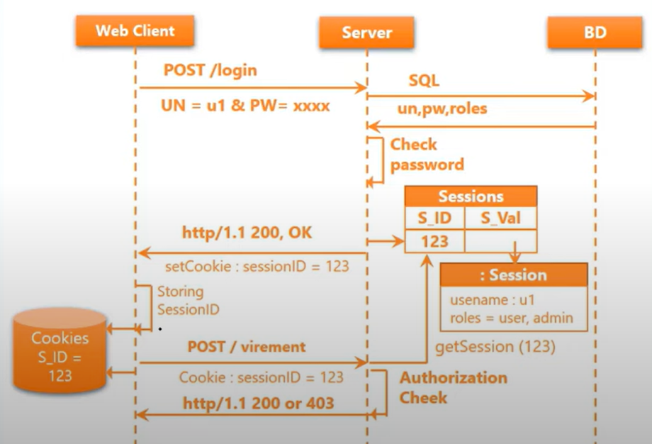
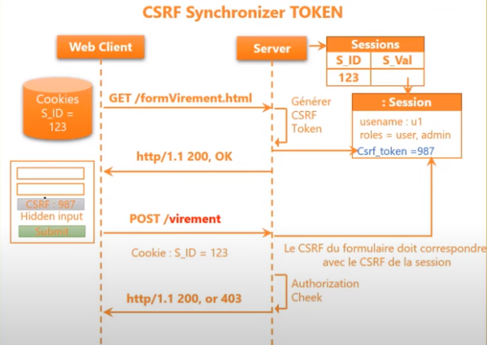
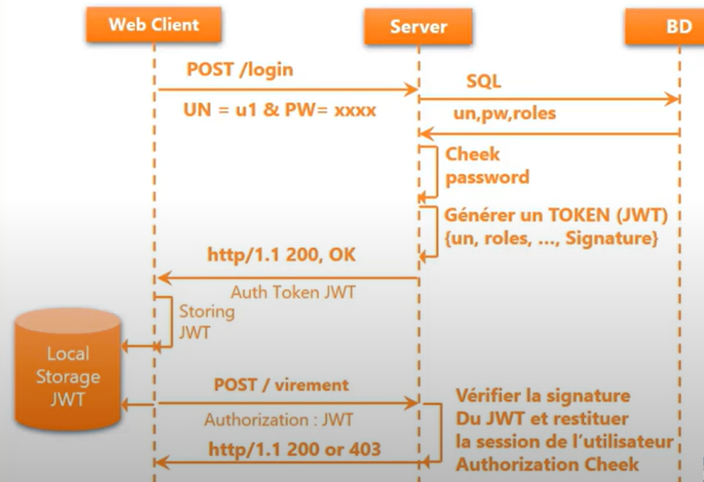

# Spring Security

## Concepts clés

 <!-- .element: width="20%" align="left"-->

 <!-- .element: width="40%" align="right"-->

----

## Concepts clés

### Authentification

- Consiste à vérifier l'identité d'un utilisateur

- Généralement via un couple login/mot de passe

- Peut être réalisée via des tokens, des certificats, etc.

----

## Concepts clés

### Autorisation

- Une fois l'identité vérifiée, il faut vérifier les droits de l'utilisateur

- Indiquera si l'utilisateur a le droit d'accéder à une ressource

----

## Concepts clés

### Authentification + Autorisation

- Vous entrez dans un hôtel, on vérifie votre identité (authentification)

- On vous donne une carte pour accéder à votre chambre (autorisation)

- La carte ne vous donne accès qu'à votre chambre, pas à celle des autres

- Les femmes de chambre ont une carte qui leur donne accès à toutes les chambres

----

## Concepts clés

## Systèmes d'authentification

- **Stateful** : la session est conservée par le serveur

- **Stateless** : les données de la session sont conservées par le client

> Chaque système a ses avantages et inconvénients

----

## Concepts clés

### Authentification stateful

 <!-- .element: width="70%"-->

----

## Stateful Authentication

### Avantages

- Facile à mettre en place

- Relativement facile à comprendre

- Permet de gérer des sessions

----

## Stateful Authentication

### Inconvénients

- Nécessite de stocker des données côté serveur

- Relativement peu sécurisé

----

## Stateful Authentication

### CSRF (Cross-Site Request Forgery)

- Attaque qui consiste à forcer un utilisateur à exécuter des actions non désirées

- Se base sur les cookies de session, pour envoyer des requêtes non désirées à partir du navigateur de la victime

- Il suffit de cliquer sur un lien pour que l'attaque soit exécutée !

----

## CSRF

### En étapes

- Je me connecte sur le site de ma banque

- Je reçois un mail avec un lien, qui me demande de cliquer pour gagner un iPhone

- Je clique, le lien envoie une requête à ma banque pour effectuer un virement

> Je n'ai rien vu, mais j'ai perdu 1000€

----

## CSRF

### Contre-mesures avec Stateful

CSRF Synchronizer Token Pattern :

- Consiste à ajouter un token dans les formulaires (hidden input)

- Le token est généré côté serveur, lorsqu'on demande le formulaire

- À la complétion du formulaire, le token est vérifié

----

## CSRF

### En images

 <!-- .element: width="70%"-->

----

## CSRF

### Contre-mesures avec Stateful

Demander une confirmation à l'utilisateur :

- Avant de réaliser une action sensible, demander une confirmation à l'utilisateur

- La plupart des banques demandent une confirmation par SMS pour les virements

- Ce faisant, on s'assure que l'utilisateur est bien à l'origine de l'action !

----

## CSRF

### Autres contre-mesures

- Eviter d'utiliser des GET pour des actions sensibles

- Demander des confirmations pour les actions sensibles

- Effectuer une vérification du **Referer** (l'origine de la requête)

----

## Stateful Authentication

### Quand l'utiliser ?

- Pour des applications internes

- Pour des applications qui ne gèrent pas de données sensibles

> Les données personnelles sont des données sensibles !

----

## Concepts clés

### Authentification stateless

 <!-- .element: width="70%"-->

----

## JWT (JSON Web Token)

### Principe

- Un token est généré côté serveur, lors de l'authentification

- Le token est envoyé au client

- Le client renvoie le token à chaque requête

----

## JWT

### Structure

- Le token est composé de 3 parties, séparées par des points

- Header : type de token et algorithme de cryptage

- Payload : données de l'utilisateur

- Signature : permet de vérifier l'intégrité du token

----

## JWT

### Exemple de JWT

`
eyJhbGciOiJIUzI1NiIsInR5cCI6IkpXVCJ
.eyJzdWIiOiIxMjM0NTY3ODkwIiwibmFtZSI6Ikp
.SflKxwRJSMeKKF2QT4fwpMeJf36POk6yJV_adQssw5c
`

----

## JWT

### Header

- La chaîne de caractères **eyJhbGciOiJIUzI1NiIsInR5cCI6IkpXVCJ**

- C'est un JSON, qui a été haché en base64. 

- Il est décodable

> base64 est un encodage, pas un cryptage

----

## JWT

### Header décodé

```json
{
  "alg": "HS256",
  "typ": "JWT"
}
```
- **alg** : algorithme de cryptage
- **typ** : type de token

----

## JWT

### Algorithme de cryptage

- Plusieurs algorithmes possibles

- **HS256** : HMAC avec SHA-256

- **RS256** : RSA avec SHA-256

----

## JWT

### HS256

- HMAC (Hash-based Message Authentication Code)

- Utilise une clé secrète pour signer le token

- La clé secrète est connue du serveur et du client

> Problème : si la clé est compromise, tous les tokens sont compromis

----

## JWT

### RS256

- RSA (Rivest, Shamir, Adleman)

- Utilise une paire de clés : une publique et une privée

- La clé privée est connue du serveur, la clé publique est connue du client

- La clé privée est utilisée pour signer le token, la clé publique pour le vérifier

- La clé privée n'étant pas partagée, le risque de compromission est moindre

----

## JWT

### Payload

- La chaîne de caractères **eyJzdWIiOiIxMjM0NTY3ODkwIiwibmFtZSI6Ikp**

- Comme pour le header, c'est un JSON haché en base64, décodable

- Il contient les données de l'utilisateur

- On parle de **claims**

----

## JWT

### Payload décodé

```json
{
  "sub": "1234567890",
  "name": "John Doe",
  "iat": 1516239022,
  "exp": 1516239022,
  "roles": [
    "ADMIN",
    "USER"
  ],
  "iss": "https://octocorn.com",
  "jti": "a-123",
  "nbf": 1516239022
}
```

----

## JWT

### Payload décodé

- **sub** : subject, identifiant de l'utilisateur

- **name** : nom de l'utilisateur

- **iat** (issued at) : date de création du token (UNIX) 

- **exp** (expiration) : date d'expiration du token (UNIX) 

----

## JWT

### Payload décodé

- **roles** : rôles de l'utilisateur

- **iss** (issuer) : émetteur du token

- **jti** (JWT ID) : identifiant unique du token

- **nbf** (not before) : date à partir de laquelle le token est valide

----

## JWT

### Signature

- La chaîne de caractères **SflKxwRJSMeKKF2QT4fwpMeJf36POk6yJV_adQssw5c**

- C'est la signature du token. Elle est calculée à partir du header et du payload

- On utilise également la clé secrète pour signer le token

----

## JWT

### Signature

- La signature permet de vérifier l'intégrité du token

- Si le token est modifié, la signature ne correspondra plus

- La signature est vérifiée côté serveur

----

## JWT

### Pourquoi ne pas envoyer le JSON ?

- Le token est plus compact

- Il peut être stocké dans un cookie, un header, ou un paramètre d'URL

- Il est facile à transmettre

- Ces informations n'étant pas sensibles, on peut les envoyer sans cryptage

----

## JWT

### Ou est stocké le token ?

- Dans un cookie, session, ou local storage

> Mais pourquoi c'est plus sécurisé que le stateful ?

----

## JWT

### Pas inviolable

- Le JWT nous prémunit contre le CSRF, mais pas contre le XSS

- Il est donc plus sécurisé, mais pas inviolable

- En revanche, il est plus difficile de voler un token que de voler une session dans un cookie

----

## XSS (Cross-Site Scripting)

### RAV avec l'authentification, mais toujours intéressant !

- Attaque qui consiste à injecter du code malveillant dans une page web

- Le code injecté est exécuté par le navigateur de la victime

- Peut être utilisé pour beaucoup de choses : vol de session/jeton, enregistrement de frappes, etc.

----

## JWT

### JWT.io

- Site qui permet de décoder un token JWT

- Permet de voir le contenu du token, et de vérifier sa signature

- Permet de voir si le token est valide

----

## JWT

### Exemple avec JWT.io

Créez le token suivant :

```json
{
  "sub": "1234567890",
  "name": "John Doe",
  "iat": 1516239022,
  "exp": 1516239022,
  "roles": [
    "ADMIN",
    "USER"
  ],
    "iss": "https://octocorn.com",
    "jti": "a-123",
    "nbf": 1516239022
}
```

---

## Spring Security

### Basic Security

 <!-- .element: width="20%" align="left"-->

 <!-- .element: width="40%" align="right"-->

----

## Spring Security

### Définition

- Framework de sécurité pour les applications Java

- Offre des fonctionnalités d'authentification et d'autorisation

- Intégration avec Spring Boot

----

## Spring Security

### Installation

- Ajouter la dépendance dans le fichier `pom.xml`

```xml
<dependency>
    <groupId>org.springframework.boot</groupId>
    <artifactId>spring-boot-starter-security</artifactId>
</dependency>
```

> Puis, redémarrer l'application

----

## Spring Security

### Ce qui a changé

- Au lancement de l'application, Spring Security génère un mot de passe aléatoire

- Il est accessible dans la console, sous la forme `Using generated security password: 12345678-1234-1234-1234-1234567890ab`

- Avec la configuration par défaut, il est nécessaire de s'authentifier pour accéder à l'application

----

## Spring Security

### Effectuer des requêtes

- Essayez de faire une requête sur l'application : vous serez bloqué par Spring Security

- Avec Postman, vous pouvez saisir les identifiants dans l'onglet `Authorization`

- L'utilisateur par défaut est `user`, le mot de passe est celui généré par Spring Security

----

## Spring Security

### Via navigateur

- Si vous essayez d'accéder à l'application via un navigateur, vous serez redirigé vers une page de login

- Vous pouvez vous connecter avec les identifiants par défaut

- Regardez dans les cookies : un cookie de session a été créé

----

## Spring Security

### Configuration

- Spring Security est configuré par défaut

- Il est possible de le configurer via des classes Java

----

## Spring Security

### Configuration

- Créez un package `security` dans le dossier `src/main/java`

- Ajoutez une classe `SecurityConfig` dans ce package

- Ajoutez l'annotation `@Configuration` sur la classe

----

## Spring Security

### Configuration

```java [0]
@Configuration
public class SecurityConfig {

    @Bean
    public InMemoryUserDetailsManager userDetailsManager() {

        UserDetails user = User.builder()
                .username("user")
                .password("user")
                .build();

        UserDetails employee = User.builder()
                .username("employee")
                .password("employee")
                .build();

        UserDetails admin = User.builder()
                .username("admin")
                .password("admin")
                .build();

        return new InMemoryUserDetailsManager(user, employee, admin);
    }
}
```

----

## Spring Security

### InMemoryUserDetailsManager

- Permet de définir des utilisateurs en mémoire

- Ils sont "hardcodés" dans le code de l'application

- C'est une solution de dépannage, à **NE PAS FAIRE** en production

----

## Spring Security

### UserDetails

- Interface qui représente un utilisateur

- Elle est apportée par Spring Security

- Elle contient déjà tout ce qui est nécessaire pour gérer un utilisateur

- Elle sert généralement de base pour une classe qui représente un utilisateur (héritage)

----

## Spring Security

### Essai

- Une fois cette configuration passée, l'identifiant par défaut est désactivé

- En revanche, vous ne pouvez toujours pas accéder à l'application

- Regardez la console : There is no PasswordEncoder mapped for the id "null"

----

## Spring Security

### PasswordEncoder

- Spring Security a besoin d'un `PasswordEncoder` pour encoder les mots de passe

- Cela permet de sécuriser les mots de passe en base de données

- Il est nécessaire de définir un `PasswordEncoder` dans la configuration

- Pour ce faire, il suffit de créer un autre `@Bean` dans la classe `SecurityConfig`

----

## Spring Security

### PasswordEncoder

```java [4-7 | 12, 15 ]
@Configuration
public class SecurityConfig {

    @Bean
    public BCryptPasswordEncoder passwordEncoder() {
        return new BCryptPasswordEncoder();
    }

    @Bean
    public InMemoryUserDetailsManager userDetailsManager() {

        BCryptPasswordEncoder encoder = passwordEncoder();
        UserDetails user = User.builder()
                .username("user")
                .password(encoder.encode("user"))
                .build();

        UserDetails employee = User.builder()
                .username("employee")
                .password(encoder.encode("employee"))
                .roles("EMPLOYEE", "USER")
                .build();

        UserDetails admin = User.builder()
                .username("admin")
                .password(encoder.encode("admin"))
                .roles("EMPLOYEE", "USER", "ADMIN")
                .build();

        return new InMemoryUserDetailsManager(user, employee, admin);
    }
}
```

----

## Spring Security

### BCryptPasswordEncoder

- Implémentation de `PasswordEncoder` qui utilise l'algorithme de cryptage BCrypt

- BCrypt est un algorithme de cryptage de mots de passe qui est très sécurisé

- Il est recommandé par la plupart des experts en sécurité

----

## Spring Security

### Essai

- Cette fois, on peut accéder à nos ressources sans problème

- En revanche, une fois authentifié, on peut accéder à toutes les ressources !

- Dans notre cas, on aimerait ajouter des autorisations

----

## Spring Security

### Notre plan : utilisateur non authentifié

- `GET` sur toute l'application

----

## Spring Security

### Notre plan : Utilisateur

- `GET` sur toute l'application
- `POST` uniquement sur `/seances/{id}/reservations`
- Tout le reste est interdit

----

## Spring Security

### Notre plan : Employé

- `GET`, `POST`, `PUT` sur toute l'application
- Tout le reste est interdit

----

## Spring Security

### Notre plan : Administrateur

- Tout est autorisé

----

## Spring Security

### Configuration

```java [33-43]
@Configuration
public class SecurityConfig {

    @Bean
    public BCryptPasswordEncoder passwordEncoder() {
        return new BCryptPasswordEncoder();
    }

    @Bean
    public InMemoryUserDetailsManager userDetailsManager() {

        BCryptPasswordEncoder encoder = passwordEncoder();
        UserDetails user = User.builder()
                .username("user")
                .password(encoder.encode("user"))
                .roles("USER")
                .build();

        UserDetails employee = User.builder()
                .username("employee")
                .password(encoder.encode("employee"))
                .roles("EMPLOYEE", "USER")
                .build();

        UserDetails admin = User.builder()
                .username("admin")
                .password(encoder.encode("admin"))
                .roles("EMPLOYEE", "USER", "ADMIN")
                .build();

        return new InMemoryUserDetailsManager(user, employee, admin);
    }

    @Bean
    public SecurityFilterChain defaultSecurityFilterChain(HttpSecurity http) throws Exception {
        http.authorizeHttpRequests(authorizeRequests ->
                authorizeRequests
                        .requestMatchers(HttpMethod.GET, "/*").permitAll()
                        .requestMatchers(HttpMethod.POST, "/seances/{id}/reserver").hasRole("USER")
                        .anyRequest().authenticated()
        )
                .formLogin(withDefaults());
    }
}
```

----

## Spring Security

### SecurityFilterChain

- Permet de définir des règles de sécurité

- On peut définir plusieurs `SecurityFilterChain` dans une application

- Chaque `SecurityFilterChain` peut avoir des règles différentes

- On peut définir des règles pour les requêtes HTTP, les rôles, etc.

----

## Spring Security

### Essai

- Si vous essayez de vous connecter via un navigateur, vous serez redirigé vers une page de login

- En revanche, si vous essayez de faire un POST via Postman, vous serez bloqué

> A votre avis, pourquoi ?

----

## Spring Security

### CSRF

- Spring Security bloque les requêtes POST, PUT, DELETE, etc. qui ne contiennent pas de token CSRF

- Ce token est généré côté serveur, et envoyé au client

- One ne peut pas faire de requête POST sans ce token

- Il est possible de désactiver cette fonctionnalité, mais ce n'est pas recommandé

----

## Spring Security

### Désactiver CSRF

```java [44-48]
@Configuration
public class SecurityConfig {

    @Bean
    public BCryptPasswordEncoder passwordEncoder() {
        return new BCryptPasswordEncoder();
    }

    @Bean
    public InMemoryUserDetailsManager userDetailsManager() {

        BCryptPasswordEncoder encoder = passwordEncoder();
        UserDetails user = User.builder()
                .username("user")
                .password(encoder.encode("user"))
                .roles("USER")
                .build();

        UserDetails employee = User.builder()
                .username("employee")
                .password(encoder.encode("employee"))
                .roles("EMPLOYEE", "USER")
                .build();

        UserDetails admin = User.builder()
                .username("admin")
                .password(encoder.encode("admin"))
                .roles("EMPLOYEE", "USER", "ADMIN")
                .build();

        return new InMemoryUserDetailsManager(user, employee, admin);
    }

    @Bean
    public SecurityFilterChain defaultSecurityFilterChain(HttpSecurity http) throws Exception {
        http.authorizeHttpRequests(authorizeRequests ->
                authorizeRequests
                        .requestMatchers(HttpMethod.GET, "/*").permitAll()
                        .requestMatchers(HttpMethod.POST, "/seances/{id}/reserver").hasRole("USER")
                        .anyRequest().authenticated()
        )
                .formLogin(withDefaults());

        // Active l'autorisation HTTP Basic
        http.httpBasic(Customizer.withDefaults());

        // Désactive la protection CSRF
        http.csrf(AbstractHttpConfigurer::disable);

        return http.build();
    }
}
```

----

## A vous de jouer

Ajouter la configuration pour les autres rôles : 

- Employé : GET, POST, PUT sur toute l'application
- Admin : Tout est autorisé

----

## Correction

```java
@Configuration
@EnableWebSecurity
public class SecurityConfig {

    @Bean
    public BCryptPasswordEncoder passwordEncoder() {
        return new BCryptPasswordEncoder();
    }

    @Bean
    public InMemoryUserDetailsManager userDetailsManager() {

        BCryptPasswordEncoder encoder = passwordEncoder();
        UserDetails user = User.builder()
                .username("user")
                .password(encoder.encode("user"))
                .roles("USER")
                .build();

        UserDetails employee = User.builder()
                .username("employee")
                .password(encoder.encode("employee"))
                .roles("EMPLOYEE", "USER")
                .build();

        UserDetails admin = User.builder()
                .username("admin")
                .password(encoder.encode("admin"))
                .roles("EMPLOYEE", "USER", "ADMIN")
                .build();

        return new InMemoryUserDetailsManager(user, employee, admin);
    }

    @Bean
    public SecurityFilterChain defaultSecurityFilterChain(HttpSecurity http) throws Exception {
        http.authorizeHttpRequests(authorizeRequests ->
                authorizeRequests
                        .requestMatchers(HttpMethod.GET, "/**").permitAll()
                        .requestMatchers(HttpMethod.POST, "/seances/{id}/reserver").hasRole("USER")
                        .requestMatchers(HttpMethod.POST, "/**").hasRole("EMPLOYEE")
                        .requestMatchers(HttpMethod.PUT, "/**").hasRole("EMPLOYEE")
                        .requestMatchers(HttpMethod.DELETE, "/**").hasRole("ADMIN")
                        .anyRequest().authenticated()
        )
                .formLogin(withDefaults());

        // Active l'autorisation HTTP Basic
        http.httpBasic(Customizer.withDefaults());

        // Désactive la protection CSRF
        http.csrf(AbstractHttpConfigurer::disable);

        return http.build();
    }
}
```

---

## Spring Security

### Basic Auth + BDD

 <!-- .element: width="20%" align="left"-->

 <!-- .element: width="40%" align="right"-->

----

## Spring Security

### Gestion d'utilisateurs

- Pour le moment, nous avons défini des utilisateurs en mémoire

- En production, on utilisera une base de données qui permettra de gérer les utilisateurs et les rôles

- Elle permet généralement l'inscription, la connexion, la gestion des mots de passe, etc.

> Pour cette partie, nous allons nous concentrer sur la création et la connexion

----

## Spring Security

### Création d'un utilisateur

- Il nous faudra créer un entité `User` qui représente un utilisateur

- Cette entité héritera de `UserDetails`, qui nous est apporté par Spring Security

- Nous allons également créer une table de rôles

----

## Spring Security

### `security.user.Role`

```java
@Entity
@Getter
@Setter
@NoArgsConstructor
public class Role implements GrantedAuthority {
    @Id
    @GeneratedValue(strategy = GenerationType.IDENTITY)
    @Column(name = "id", nullable = false)
    private Long id;

    private String authority;
}
```

----

## Spring Security

### `security.user.Role`

- GranatedAuthority est une interface de Spring Security

- Elle représente un rôle

- Cette implémentation est nécessaire pour que Spring Security puisse gérer les rôles correctement

- Elle apporte notamment la méthode `getAuthority()`

----

## Spring Security

### `security.user.User`

```java
@Entity
@Getter
@Setter
@NoArgsConstructor
@Table(name = "users")
public class User implements UserDetails {
    @Id
    @GeneratedValue(strategy = GenerationType.IDENTITY)
    @Column(name = "id", nullable = false)
    private Long id;

    private String password;
    private String username;
    private boolean active;

    // Nous utilisons une relation OneToOne pour lier un utilisateur à un rôle
    // Ici, c'est par souci de simplicité, mais on pourrait/devrait utiliser une relation ManyToMany
    @OneToOne(cascade = CascadeType.ALL)
    private Role role;

    // Toutes ces méthodes sont nécessaires pour UserDetails
    
    @Override
    public Collection<? extends GrantedAuthority> getAuthorities() {
        return List.of(role);
    }

    @Override
    public boolean isAccountNonExpired() {
        return this.active;
    }

    @Override
    public boolean isAccountNonLocked() {
        return this.active;
    }

    @Override
    public boolean isCredentialsNonExpired() {
        return this.active;
    }

    @Override
    public boolean isEnabled() {
        return this.active;
    }
}
```

----

## Spring Security

### `security.user.User`

- `User` implémente `UserDetails`, qui est apporté par Spring Security

- `UserDetails` est une interface qui représente un utilisateur

- Elle contient toutes les informations nécessaires pour gérer un utilisateur

----

## Spring Security

### `security.user.UserRepository`

```java
public interface UserRepository extends JpaRepository<User, Long> {
    Optional<User> findByUsername(String username);
}
```

----

## Spring Security

### `security.user.UserRepository`

- Un JpaRepository qui permet de gérer les utilisateurs

- Nous ajoutons dès maintenant une méthode pour rechercher un utilisateur par son nom d'utilisateur

- Nous en aurons besoin plus tard, pour la connexion

----

## Spring Security

### `security.user.UserService`

```java
@Service
@AllArgsConstructor
// Nous implémentons l'interface UserDetailsService pour pouvoir utiliser notre propre service de gestion des utilisateurs
public class UserService implements UserDetailsService {

    private final UserRepository userRepository;

    private final BCryptPasswordEncoder passwordEncoder;

    // Méthode pour créer un utilisateur
    public User save(User user) {
        
        // Vérifier si l'utilisateur existe déjà
        if (userRepository.findByUsername(user.getUsername()).isPresent()) {
            throw new ResponseStatusException(HttpStatus.BAD_REQUEST, "Username already exists");
        }
        
        // Permet de crypter le mot de passe avant de le sauvegarder
        user.setPassword(passwordEncoder.encode(user.getPassword()));
        // Nous ajoutons une valeur par défaut pour active
        user.setActive(true);
        return userRepository.save(user);
    }

    @Override
    // Méthode qui permet de charger un utilisateur par son nom d'utilisateur.
    // Cette méthode est appelée par Spring Security lorsqu'un utilisateur tente de se connecter.
    // Elle doit retourner un objet UserDetails qui contient les informations de l'utilisateur
    public UserDetails loadUserByUsername(String username) throws UsernameNotFoundException {

        // Nous récupérons l'utilisateur par son nom d'utilisateur
        User user = userRepository.findByUsername(username)
                .orElseThrow(() -> new UsernameNotFoundException("User not found"));

        // Puis nous retournons un objet UserDetails qui contient les informations de l'utilisateur
        // Nous utilisons la classe org.springframework.security.core.userdetails.User pour créer cet objet
        // Cette classe est fournie par Spring Security et implémente l'interface UserDetails
        // Elle contient les informations de l'utilisateur nécessaires à l'authentification
        return org.springframework.security.core.userdetails.User.builder()
                .username(user.getUsername())
                .password(user.getPassword())
                .roles(user.getRole().getAuthority())
                .build();
    }
}
```

----

## Spring Security

### `security.user.UserService`

- `UserService` implémente `UserDetailsService`, qui est apporté par Spring Security

- `UserDetailsService` est une interface qui permet de gérer les utilisateurs

- Elle contient une méthode `loadUserByUsername` qui permet de charger un utilisateur par son nom d'utilisateur

- Cette méthode est indispensable pour la connexion

----

## Spring Security

### `security.user.UserController`

```java
@RestController
@RequestMapping("users")
public class UserController {
    private final UserService userService;

    public UserController(UserService userService) {
        this.userService = userService;
    }

    @PostMapping
    public User save(@RequestBody User user) {
        return userService.save(user);
    }
}
```

----

## Spring Security

### `security.user.UserController`

- Rien de particulier ici, c'est un contrôleur classique

- On a juste une méthode POST pour permettre la création. 

----

## Spring Security

### `SecurityConfig`

```java
@Configuration
@EnableWebSecurity
public class SecurityConfig {

    // Création d'un bean pour la gestion des mots de passe
    @Bean
    public BCryptPasswordEncoder passwordEncoder() {
        return new BCryptPasswordEncoder();
    }

    @Bean
    public SecurityFilterChain defaultSecurityFilterChain(HttpSecurity http) throws Exception {
        http.authorizeHttpRequests(authorizeRequests ->
                        authorizeRequests
                                .requestMatchers(HttpMethod.POST, "/users").permitAll()
                                .requestMatchers(HttpMethod.GET, "/**").permitAll()
                                .requestMatchers(HttpMethod.POST, "/seances/{id}/reserver").hasRole("USER")
                                .requestMatchers(HttpMethod.POST, "/**").hasRole("EMPLOYEE")
                                .requestMatchers(HttpMethod.PUT, "/**").hasRole("EMPLOYEE")
                                .requestMatchers(HttpMethod.DELETE, "/**").hasRole("ADMIN")
                )
                .formLogin(withDefaults());

        // Active l'autorisation HTTP Basic
        http.httpBasic(Customizer.withDefaults());

        // Désactive la protection CSRF
        http.csrf(AbstractHttpConfigurer::disable);

        return http.build();
    }

    @Bean
    //  AuthenticationManager est une interface qui permet de gérer l'authentification des utilisateurs
    public AuthenticationManager authenticationManager(
            // Elle s'appuie sur une configuration d'authentification
            // Ici, fournie par Spring Security
            AuthenticationConfiguration authenticationConfiguration
    ) throws Exception {
        // Il est bien entendu possible de personnaliser cette configuration
        return authenticationConfiguration.getAuthenticationManager();
    }

}
```

----

## Spring Security

### `SecurityConfig`

- Nous avons ajouté une règle pour permettre la création d'un utilisateur

- Nous avons également ajouté un `AuthenticationManager`

- C'est une interface qui permet de gérer l'authentification des utilisateurs

- Elle s'appuie sur une configuration d'authentification, fournie par Spring Security

----

## Spring Security

### Essai

- Essayez de créer un utilisateur via Postman

- Ensuite, essayez de vous connecter avec cet utilisateur

- Vous devriez pouvoir vous connecter sans problème !

----

## Spring Security

### A vous de jouer !

Mettez en place l'authentification sur votre projet !