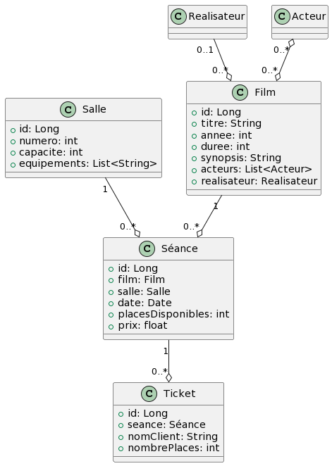

# TP 5 : Faire du chiffre 💰

## Objectifs 🎯

Ce TP a pour objectif de pratiquer les API rest avec Spring Boot.
Il vous faudra implémenter la logique de gestion sur le cinéma en lui-même.

### Prérequis 📚

- Vous vous baserez sur la démo fil rouge cinéma.

- Vous devrez donc reprendre le code de la démo et le modifier pour répondre aux exigences de ce TP.

### Rendu 📝

- Votre projet Cinema sera à rendre sur un dépot GitHub.

- Vous inclurez y README pour expliquer comment lancer votre projet.

### Evaluation 🚨

Vous serez évalué sur les points suivants :

- Qualité du README
- Qualité générale du code (découpage, documentation, bonnes pratiques, etc.)
- La complétion ou non de l'exercice
- La qualité des commits

Maintenant que nous avons fidélisé notre backend, nous allons pouvoir intégrer la gestion des séances de cinéma.

Le diagramme est le suivant :

[](https://www.planttext.com/?text=TL9BJiCm4Dtx55QMHArWQw6gYAghBX3b0gupHICSstWc4WXn8Cx1nR2Tf4agiKdoPZplCywMM4VkMYk4iPf8xj6syalKs2XvyEvLr8mSGSaZHynGEmS9ecDHDrsyVDEdyu6GPYSDGnTJuO34zmy5RKGTGLiadP6IpnCGtwE7u--FTWQMDix9c2hsafQsDblAh-GYZIkvIqzH1wiDq0ufU8Sd2pIu2n4_b3nRhtcca-UNAgvh8VfXoEYW3VAO4Dux3D22up5JdtGpCRwWUGDUKXBaC6fCbJHy-sWnqKohIgLJXATYlbTBbEKgghjAhbPULhVhzKrr8Ucj_zSSzdVLxis9sSfBPtceBBY_gx7ahzjY2wv9_ymV)

### Fonctionnalités

### De base

- CRUD complet film, acteurs et réalisateurs (normalement déjà fait)
- CRUD séances
- CRUD salles
- CRUD ticket

> Vous êtes autonomes concernant la création des DTO. Il va sans dire que les DTO doivent être lisibles et logiques !

#### Salle

- Une salle dispose d'un nom et d'une capacité

- La précision des équipements est optionnelle. On y précisera des équipements spéciaux (3D, IMAX, etc.)

Exemple de création d'une salle :

```json
{
  "nom": "Salle Très chère",
  "capacite": 100,
  "equipements": [
    "3D",
    "IMAX",
    "Dolby Atmos",
    "Dolby Vision",
    "4DX",
    "D-Box"
  ]
}
```

#### Séances

- Une séance dispose d'un film, d'une salle, d'une date et d'un prix

- Il faut donc que le film et la salle existent déjà pour créer une séance

- Le nombre de places disponibles est égal à la capacité de la salle moins le nombre de tickets réservés

Exemple de création d'une séance :

POST `/seances`

```json
{
  "film": {
    "id": 1
  },
  "salle": {
    "id": 1
  },
  "date": "2021-10-01T20:00:00",
  "prix": 10
}

```

Le retour :

```json
{
  "id": 1,
  "film": {
    "id": 1,
    "titre": "Star Wars : Episode IV - Un nouvel espoir",
    "dateSortie": "1977-05-25"
  },
  "salle": {
    "id": 1,
    "nom": "Salle Très chère",
    "capacite": 100,
    "equipements": [
      "3D",
      "IMAX",
      "Dolby Atmos",
      "Dolby Vision",
      "4DX",
      "D-Box"
    ]
  },
  "date": "2021-10-01T20:00:00",
  "prix": 10,
  "placesDisponibles": 100
}

```

##### Aides 🐣

- Vous aurez besoin de créer une méthode dans le repository `SalleRepository` qui retourne la capacité d'une salle

- Il vous faudra ensuite injecter `SalleService` dans `SeanceService` pour pouvoir appeler la méthode `findById` de `SalleService

- Grâce à ça, vous pourrez connaitre le nombre de places disponibles

- Lorsqu'un POST est effectué sur `/seances`, il faut
    - vérifier que la salle et le film existent bien, que la date est dans le futur
    - que le prix est positif.
    - Adapter le nombre de places disponibles en fonction de la capacité de la salle

#### Ticket

- Un ticket possède une séance, le nom du client, et le nombre de places qu'il a acheté

Exemple de création d'un ticket :

```json
{
  "seance": {
    "id": 1
  },
  "nomClient": "John Doe",
  "nbPlaces": 2
}
```

##### Aides 🐣

- Lorsqu'un POST est effectué sur `/tickets`, il faut
    - vérifier que la séance existe bien
    - que le nombre de places demandées est inférieur ou égal au nombre de places disponibles
    - que le nombre de places demandées est supérieur à 0
    - que le nom du client n'est pas vide

### Avancé

#### Créer une route permettant de réserver un ticket pour une séance

- POST `/seances/{id}/reserver`

La réservation d'une séance doit :
- Créer et retourner un ticket
- Mettre à jour le nombre de places disponibles pour la séance

Le body de la requête doit être le suivant :

```json
{
  "nomClient": "John Doe",
  "nbPlaces": 2
}
```

#### Créer une route permettant de récupérer les tickets réservés pour une séance

- GET `/seances/{id}/tickets`

La requête doit retourner la liste des tickets réservés pour la séance :

```json
[
  {
    "id": 1,
    "nomClient": "John Doe",
    "nbPlaces": 2
  },
  {
    "id": 2,
    "nomClient": "Jane Doe",
    "nbPlaces": 1
  }
]
```

#### Créer une route permettant de récupérer les séances à une date donnée

- GET `/seances/disponible?date=2021-10-01`

La requête doit afficher la liste des séances à cette date

```json
[
  {
    "id": 1,
    "film": {
      "id": 1,
      "titre": "Star Wars : Episode IV - Un nouvel espoir",
      "dateSortie": "1977-05-25"
    },
    "salle": {
      "id": 1,
      "nom": "Salle Très chère",
      "capacite": 100,
      "equipements": [
        "3D",
        "IMAX",
        "Dolby Atmos",
        "Dolby Vision",
        "4DX",
        "D-Box"
      ]
    },
    "date": "2021-10-01T20:00:00",
    "prix": 10,
    "placesDisponibles": 98
  },
  {
    "id": 2,
    "film": {
      "id": 2,
      "titre": "Star Wars : Episode V - L'Empire contre-attaque",
      "dateSortie": "1980-05-21"
    },
    "salle": {
      "id": 1,
      "nom": "Salle Très chère",
      "capacite": 100,
      "equipements": [
        "3D",
        "IMAX",
        "Dolby Atmos",
        "Dolby Vision",
        "4DX",
        "D-Box"
      ]
    },
    "date": "2021-10-01T20:00:00",
    "prix": 10,
    "placesDisponibles": 98
  }
]

```

#### Créer une route permettant de récupérer les séances disponibles pour un film

- GET `/film/{id}/seances`

- La route doit retourner uniquement les séances qui n'ont pas encore eu lieu

- Les séances ne doivent pas être complètes

```json
[
  {
    "id" : 1,
    "prix": 10,
    "date": "2021-10-01T20:00:00",
    "placesDisponibles": 98
  }
]
```

#### Créer une route permettant de récupérer les séances disponibles pour un film à une date donnée

- GET `/film/{id}/seances?date=2021-10-01`

- Comme pour la route précédente, sauf que l'utilisateur doit pouvoir préciser une date

```json
[
  {
    "id" : 1,
    "prix": 10,
    "date": "2021-10-01T20:00:00",
    "placesDisponibles": 98
  }
]
```

### Créer une route permettant de récupérer la liste des salles disponibles à une date donnée

- GET `/salles/disponible?date=2021-10-01`
- La route doit retourner la liste des salles qui n'ont pas de séance à cette date

```json
[
  {
    "id": 1,
    "nom": "Salle Très chère",
    "capacite": 100,
    "equipements": [
      "3D",
      "IMAX",
      "Dolby Atmos",
      "Dolby Vision",
      "4DX",
      "D-Box"
    ]
  }
]
```

### Bonus

Pour les plus pressés, vous pouvez également ajouter :
- La dockerisation du projet (avec docker-compose)
    - Monter le back + la BDD en mode production
    - Ajouter un jeu de données à la BDD lors du premier lancement
- Gérez les erreurs (404, 500, etc.)
- Ajoutez les tests unitaires